<a id="top"></a>

<div align="center">


# Credora

### Risk Intelligence

**A full-stack machine-learning credit-risk assessment workspace built with FastAPI, Scikit-learn, SQLAlchemy, React and Vite.**

Credora brings the complete credit-assessment workflow into one portfolio-grade application: secure accounts, applicant management, live scoring, engineered financial features, model benchmarking, ROC/PR analytics, dataset insights, assessment history, CSV export, printable reports, profile preferences, and light/dark interfaces.

<p>
  <a href="#getting-started"></a>
  <a href="#product-tour"></a>
  <a href="#machine-learning-system"></a>
</p>

<p>
  
  
  
  
  
  
  
  
  
</p>

**Train · Validate · Score · Explain · Persist · Review**

[Overview](#overview) · [Product Tour](#product-tour) · [ML System](#machine-learning-system) · [Architecture](#architecture) · [API](#rest-api-reference) · [Installation](#getting-started)

</div>

---

<div align="center">

### PRODUCT SHOWCASE

## Credit intelligence from applicant data to explainable risk.

<sub>Live assessment, model evidence, risk scoring, recommendations and persistent review in one enterprise-style workspace.</sub>

<br><br>

<a href="./docs/screenshots/09-prediction-result.png">
  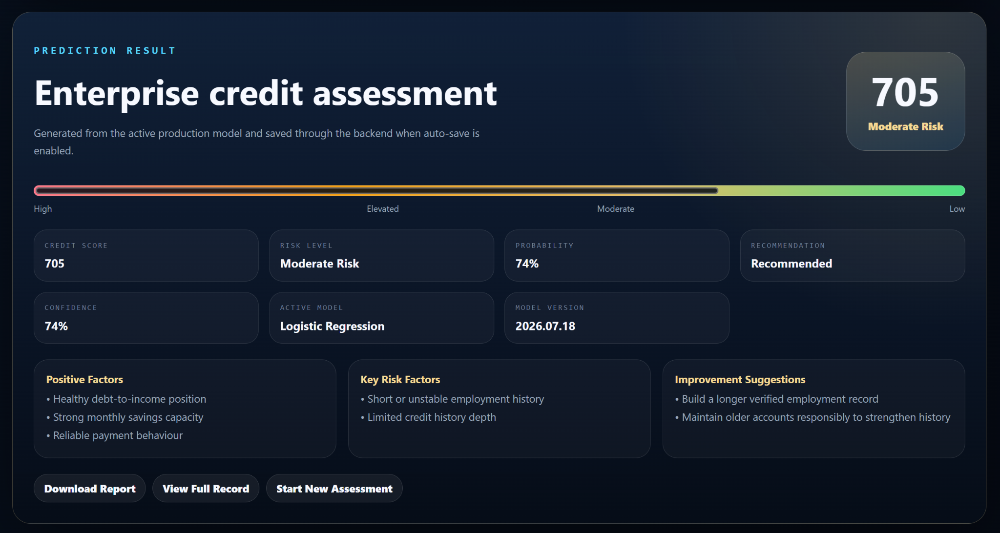
</a>

<br>

**LIVE SCORING · EXPLAINABLE RISK · MODEL TRANSPARENCY · SAVED ASSESSMENTS**

</div>

> **Portfolio focus:** Credora is presented as a complete risk-intelligence product. The hero shows the most decision-relevant output first; the product tour then reveals each operational surface individually instead of arranging screenshots as a collage.

---

## Table of Contents

- [Overview](#overview)
- [Project Vision](#project-vision)
- [Why Credora Stands Out](#why-credora-stands-out)
- [Product Tour](#product-tour)
- [Core Product Features](#core-product-features)
- [Machine Learning System](#machine-learning-system)
- [Feature Engineering](#feature-engineering)
- [Model Evaluation](#model-evaluation)
- [Credit Score and Risk Mapping](#credit-score-and-risk-mapping)
- [Architecture](#architecture)
- [Data and ML Workflow](#data-and-ml-workflow)
- [Authentication and Persistence](#authentication-and-persistence)
- [Technology Stack](#technology-stack)
- [Project Structure](#project-structure)
- [REST API Reference](#rest-api-reference)
- [Database Model](#database-model)
- [Getting Started](#getting-started)
- [Run the Application](#run-the-application)
- [Dataset and Training Commands](#dataset-and-training-commands)
- [Testing and Validation](#testing-and-validation)
- [Environment Configuration](#environment-configuration)
- [Docker](#docker)
- [Repository Hygiene](#repository-hygiene)
- [Production Hardening](#production-hardening)
- [Responsible ML and Fairness](#responsible-ml-and-fairness)
- [Author](#author)

---

## Overview

**Credora** is an end-to-end credit-risk assessment application designed as a complete machine-learning product rather than a notebook-only classification exercise.

The platform combines:

- a reusable Scikit-learn training pipeline,
- automatic feature engineering,
- three classification models,
- persisted model evaluation evidence,
- a FastAPI application layer,
- authenticated user workspaces,
- applicant and assessment records,
- live credit scoring,
- model analytics and dataset insights,
- a React/Vite user interface,
- and printable assessment reports.

A user can create an account, enter applicant and financial information, run the active trained model, receive a credit score and risk profile, review the model's probability/confidence, inspect positive and risk factors, save the assessment, revisit it later, export history to CSV, and compare trained model performance.

> Credora demonstrates ML engineering, backend architecture, frontend product development, authentication, persistence, analytics, feature engineering and responsible model presentation in one coherent system.

---

## Project Vision

A classifier by itself is only one part of a real ML application. Credora was built around the complete lifecycle:

1. Accept structured applicant, financial, loan and credit information.
2. Normalize inconsistent source columns into one internal schema.
3. Derive stable ratios and behavioural indicators.
4. Train multiple candidate models through one preprocessing pipeline.
5. Evaluate every candidate on the same stratified validation split.
6. Select the strongest candidate using validation evidence.
7. Persist metrics, curves, feature importance and dataset summaries.
8. Serve model inference through an authenticated API.
9. Convert model probability into an understandable score/risk profile.
10. Preserve assessment evidence for later review.
11. Provide operational dashboards, applicant records and history tools.
12. Keep responsible-use limitations visible around a high-impact domain.

The result is a portfolio project that shows the difference between **training a model** and **engineering a usable ML system**.

---

## Why Credora Stands Out

| Area | Implementation |
|---|---|
| **Complete ML application** | Training, feature engineering, model selection, inference, persistence, API routes and frontend workflows live in one project. |
| **Three-model benchmark** | Logistic Regression, Decision Tree and Random Forest are trained and evaluated under the same pipeline. |
| **Dual dataset support** | The project includes both a 2,600-record synthetic dataset and an included Kaggle credit-risk dataset. |
| **29 operational features** | Raw applicant values are expanded with debt, savings, loan, employment, payment and credit-history indicators. |
| **Real evaluation evidence** | Accuracy, Precision, Recall, F1, ROC-AUC, confusion matrices, ROC curves, precision-recall curves and feature importance are persisted. |
| **Live scoring workflow** | The frontend sends applicant data to the backend model service and renders score, risk, probability, confidence and business-facing factors. |
| **Persistent workspace** | Applicants, assessments, settings, model metrics and dataset summaries are stored through SQLAlchemy. |
| **Explainability layer** | Every assessment returns positive factors, risk factors and improvement suggestions in addition to the numeric result. |
| **Model transparency** | Dedicated model analytics compare all trained candidates and expose validation evidence. |
| **Operational reporting** | Assessment history can be searched, reviewed, deleted, exported to CSV and rendered as a printable report. |
| **Secure session design** | Passwords use PBKDF2-HMAC-SHA256; random session tokens are stored server-side as SHA-256 digests and delivered with an HttpOnly SameSite cookie. |
| **Professional UX** | Landing/auth flows, operational dashboard, live scoring, model analytics, insights, applicant records, history and settings are presented in a consistent enterprise interface. |

---

# Product Tour

The visual tour follows the real Credora workflow in a clean, full-width sequence. **Every major screen is presented individually** to keep the README polished, readable and portfolio-grade.

## 01 · Product entry

<a href="./docs/screenshots/01-landing-dark.png">
  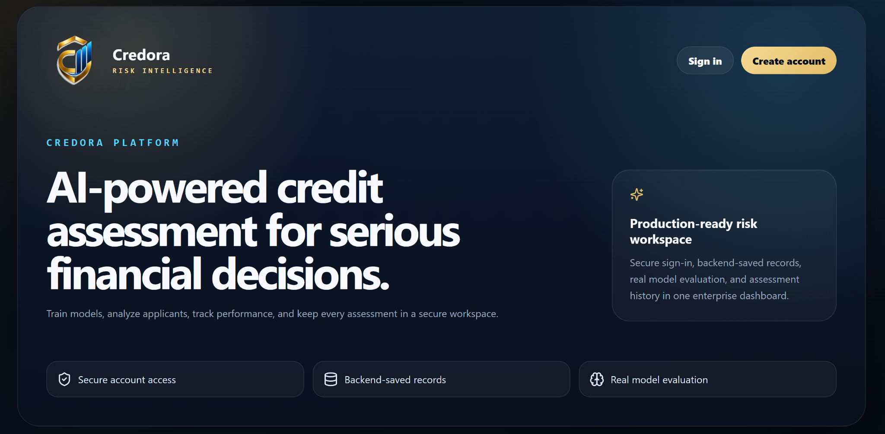
</a>

<p align="center"><sub><strong>Landing Experience:</strong> product positioning, secure account access, backend-saved records and model-evaluation messaging.</sub></p>

<details>
<summary><strong>View sign-in screen</strong></summary>
<br>
<a href="./docs/screenshots/02-sign-in-dark.png"></a>
</details>

<details>
<summary><strong>View account creation screen</strong></summary>
<br>
<a href="./docs/screenshots/03-create-account-dark.png">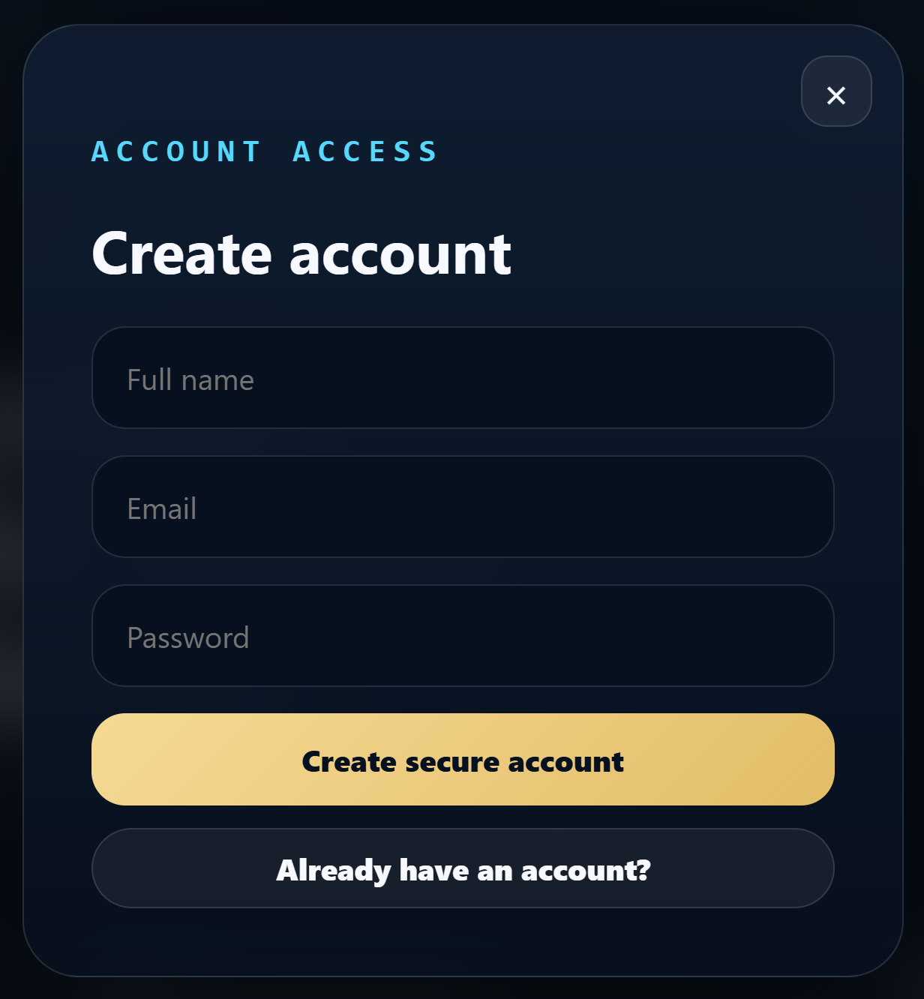</a>
</details>

---

## 02 · Operational dashboard

<a href="./docs/screenshots/04-overview-dark-empty.png">
  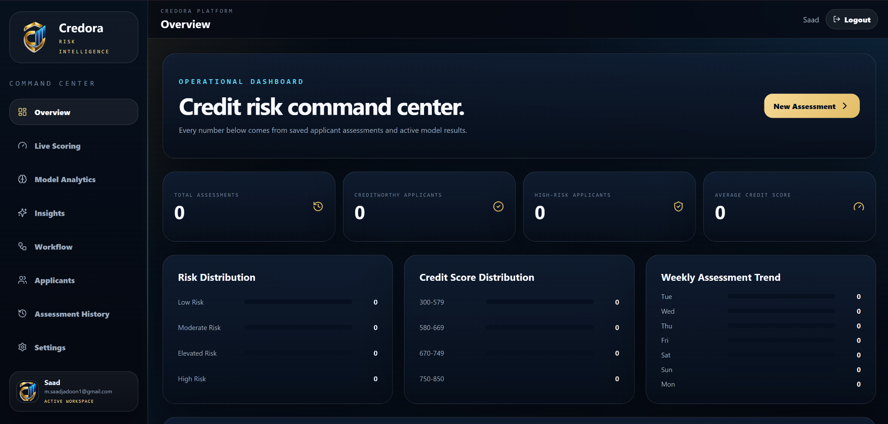
</a>

<p align="center"><sub><strong>Fresh Workspace:</strong> assessment totals, risk distribution, score distribution and weekly activity begin from real persisted data.</sub></p>

<details>
<summary><strong>View populated dashboard in light mode</strong></summary>
<br>
<a href="./docs/screenshots/05-overview-light-populated.png">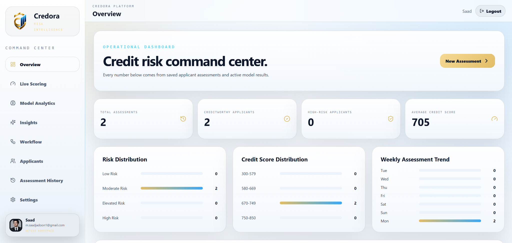</a>
</details>

---

## 03 · Live credit assessment

<a href="./docs/screenshots/06-live-scoring-applicant.png">
  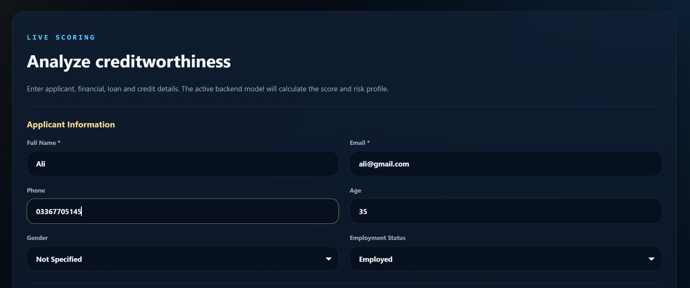
</a>

<p align="center"><sub><strong>Applicant Profile:</strong> identity, age, contact and employment information begin the scoring workflow.</sub></p>

<details>
<summary><strong>View financial and loan information</strong></summary>
<br>
<a href="./docs/screenshots/07-live-scoring-financial-loan.png">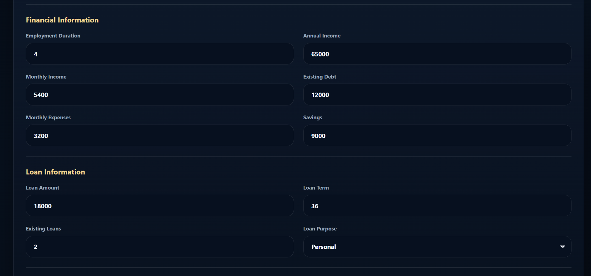</a>
</details>

<details>
<summary><strong>View credit information and assessment action</strong></summary>
<br>
<a href="./docs/screenshots/08-live-scoring-credit-submit.png">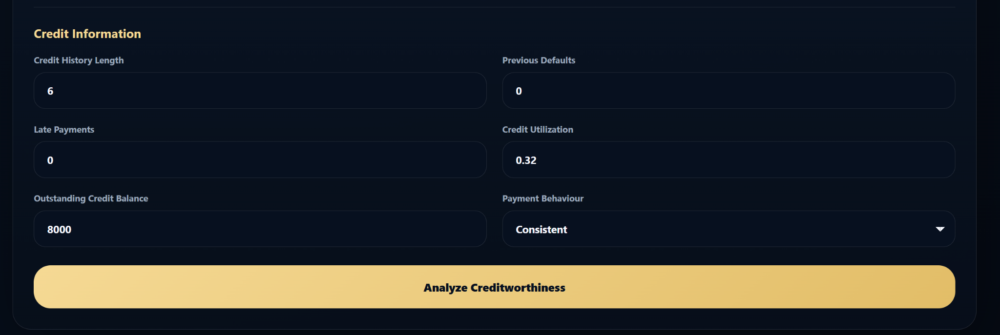</a>
</details>

---

## 04 · Enterprise assessment result

<a href="./docs/screenshots/09-prediction-result.png">
  
</a>

<p align="center"><sub><strong>Explainable Result:</strong> score, risk level, probability, confidence, recommendation, active model, positive factors, risk factors and improvement suggestions.</sub></p>

---

## 05 · Printable assessment evidence

<a href="./docs/screenshots/10-assessment-report.png">
  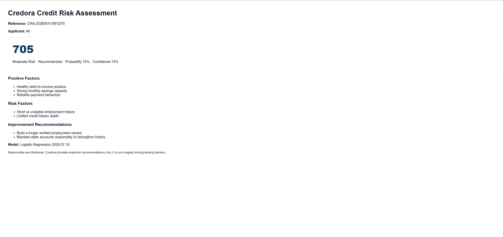
</a>

<p align="center"><sub><strong>Assessment Report:</strong> reference, applicant identity, decision evidence, model information and responsible-use disclaimer in a printable format.</sub></p>

---

## 06 · Model Analytics — Logistic Regression

<a href="./docs/screenshots/11-model-analytics-logistic-regression.png">
  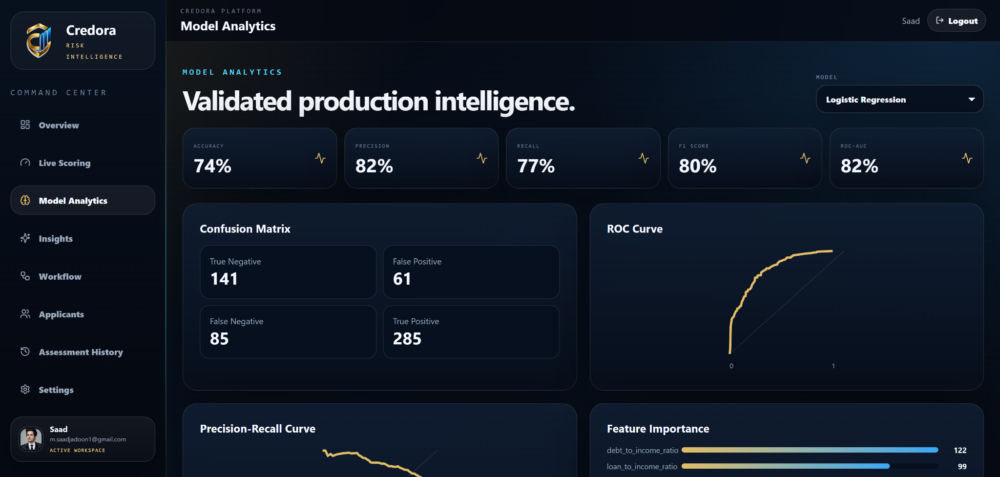
</a>

<p align="center"><sub><strong>Production Evidence:</strong> validation metrics, confusion matrix, ROC/PR curves and feature importance for the selected model.</sub></p>

<details>
<summary><strong>View Random Forest analytics</strong></summary>
<br>
<a href="./docs/screenshots/12-model-analytics-random-forest.png">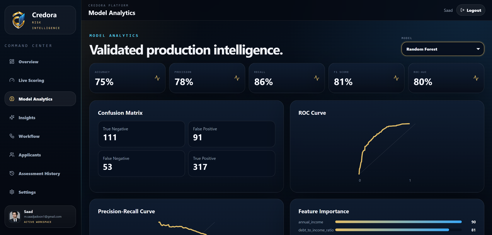</a>
</details>

<details>
<summary><strong>View Decision Tree analytics</strong></summary>
<br>
<a href="./docs/screenshots/13-model-analytics-decision-tree.png">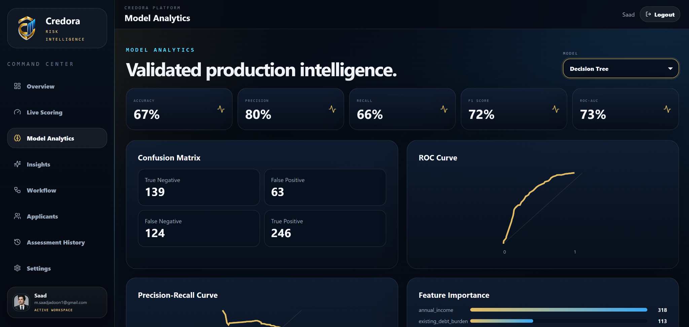</a>
</details>

---

## 07 · Model comparison

<a href="./docs/screenshots/14-model-comparison.png">
  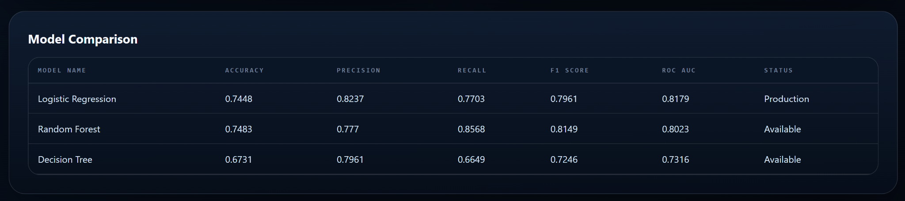
</a>

<p align="center"><sub><strong>Model Selection:</strong> Accuracy, Precision, Recall, F1 and ROC-AUC are compared before the active artifact is selected.</sub></p>

---

## 08 · Dataset intelligence

<a href="./docs/screenshots/15-insights-dark.png">
  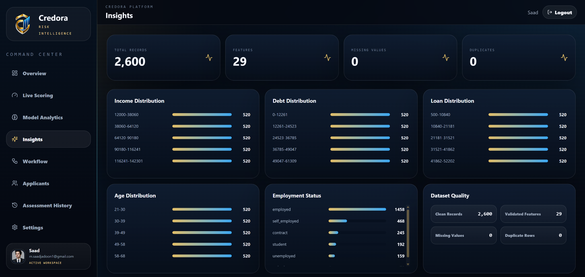
</a>

<p align="center"><sub><strong>Data Evidence:</strong> record counts, feature counts, missing values, duplicates and dataset distributions are visible inside the application.</sub></p>

<details>
<summary><strong>View insights in light mode</strong></summary>
<br>
<a href="./docs/screenshots/19-insights-light.png">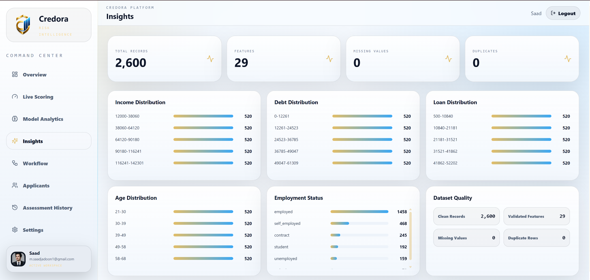</a>
</details>

---

## 09 · Applicant records

<a href="./docs/screenshots/16-applicants-dark.png">
  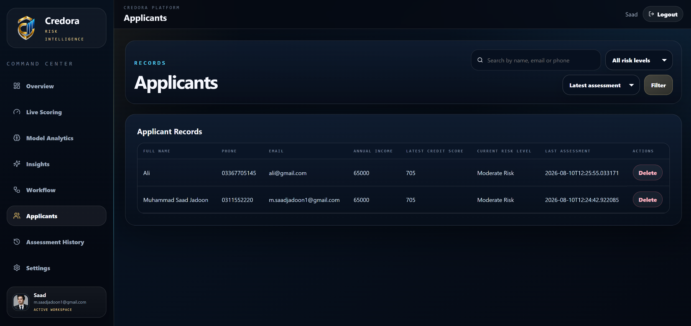
</a>

<p align="center"><sub><strong>Applicant Management:</strong> searchable records connect identity, income, latest score, risk level and assessment activity.</sub></p>

---

## 10 · Assessment history

<a href="./docs/screenshots/17-assessment-history-dark.png">
  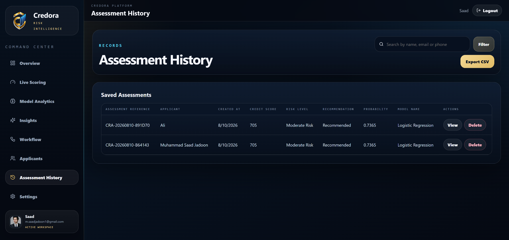
</a>

<p align="center"><sub><strong>Saved Evidence:</strong> assessment references, model identity, scores, recommendations, view/delete actions and CSV export.</sub></p>

---

## 11 · Account, application and security settings

<a href="./docs/screenshots/18-settings-light.png">
  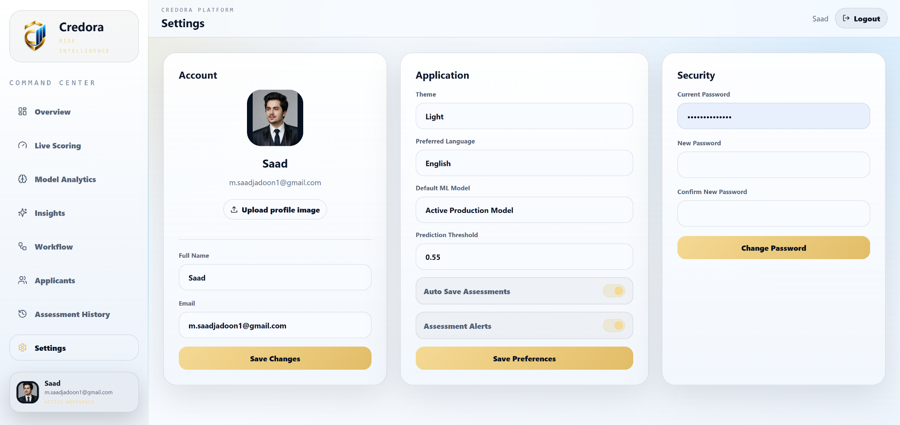
</a>

<p align="center"><sub><strong>Settings Workspace:</strong> profile, theme, model preference, threshold, auto-save, alerts and password management.</sub></p>

<p align="right"><a href="#top">Back to top ↑</a></p>

---

# Core Product Features

### Credit assessment
- Structured applicant, employment, income, debt, savings, loan and credit-history inputs
- Backend inference from the active Joblib model artifact
- Probability and confidence output
- 300–850 score mapping
- Four risk bands
- Recommendation status
- Positive-factor, risk-factor and improvement-message generation

### Model intelligence
- Logistic Regression
- Decision Tree
- Random Forest
- Shared preprocessing pipeline
- Stratified train/test split
- Accuracy, Precision, Recall, F1 and ROC-AUC
- Confusion matrices
- ROC curves
- Precision-recall curves
- Feature importance
- Automatic active-model selection after training

### Data intelligence
- Included synthetic dataset
- Included Kaggle credit-risk dataset
- Alias-based source-column normalization
- Duplicate detection/removal
- Missing-value handling
- Target normalization
- Distribution summaries
- Correlation data
- Dataset quality cards

### Workspace operations
- Secure registration, sign-in and sign-out
- User profile and profile-image upload
- Applicant CRUD
- Assessment history
- Assessment deletion
- CSV export
- Printable assessment report
- Dashboard summaries
- Search/filter controls
- Light/dark workspace presentation

---

# Machine Learning System

Credora uses one reusable training pipeline for all candidate classifiers.

## Candidate Models

| Candidate | Implementation |
|---|---|
| **Logistic Regression** | `LogisticRegression(max_iter=1400, class_weight="balanced", random_state=42)` |
| **Decision Tree** | `DecisionTreeClassifier(max_depth=7, min_samples_leaf=25, class_weight="balanced", random_state=42)` |
| **Random Forest** | `RandomForestClassifier(n_estimators=180, max_depth=11, min_samples_leaf=6, class_weight="balanced", random_state=42, n_jobs=-1)` |

## Shared preprocessing

Numeric features:

```text
Median imputation → StandardScaler
```

Categorical features:

```text
Most-frequent imputation → OneHotEncoder(handle_unknown="ignore")
```

Both branches are assembled with `ColumnTransformer` and combined with the classifier in a Scikit-learn `Pipeline`.

## Validation strategy

```text
Train / test split: 78% / 22%
Random state: 42
Stratification: target label
Classification threshold during evaluation: 0.50
```

After every training run, candidates are ranked by:

```text
ROC-AUC → F1 → Recall → Precision → Accuracy
```

The highest-ranked model becomes the active artifact written to:

```text
backend/artifacts/active_model.joblib
```

---

# Feature Engineering

The model receives **29 operational features**: 25 numeric/engineered values plus four categorical fields.

## Core numeric inputs

```text
age
annual_income
monthly_income
employment_duration
existing_debt
monthly_expenses
savings
loan_amount
loan_term
existing_loans
credit_history_length
previous_defaults
late_payments
credit_utilization
outstanding_credit_balance
```

## Engineered numeric features

| Feature | Purpose |
|---|---|
| `debt_to_income_ratio` | Existing debt relative to annual income |
| `monthly_savings` | Monthly income minus monthly expenses |
| `loan_to_income_ratio` | Requested loan relative to annual income |
| `expense_to_income_ratio` | Monthly expenses relative to monthly income |
| `savings_rate` | Monthly savings relative to monthly income |
| `existing_debt_burden` | Combined existing debt and outstanding balance relative to income |
| `credit_history_stability` | Credit-history length normalized against a 15-year cap |
| `employment_stability` | Employment duration normalized against an 8-year cap |
| `payment_reliability_indicator` | Reliability signal derived from late payments/defaults |
| `previous_default_indicator` | Binary previous-default signal |

## Categorical features

```text
gender
employment_status
loan_purpose
payment_behaviour
```

The training mapper can recognize common alternative CSV names such as:

```text
person_age
person_income
person_emp_length
loan_amnt
loan_intent
loan_status
cb_person_default_on_file
cb_person_cred_hist_length
```

For the Kaggle-style `loan_status` field, the project normalizes the target so that internal target `1` consistently means **creditworthy / good credit**.

---

# Model Evaluation

The following results were reproduced from the supplied project snapshot using the repository's own training command and datasets.

## Included synthetic dataset — 2,600 records

```powershell
python -m app.ml.train --dataset synthetic
```

| Model | Accuracy | Precision | Recall | F1 | ROC-AUC | Training Selection |
|---|---:|---:|---:|---:|---:|---|
| **Logistic Regression** | 74.48% | 82.37% | 77.03% | 79.61% | **81.79%** | **Active for this dataset** |
| Random Forest | **74.83%** | 77.70% | **85.68%** | **81.49%** | 80.23% | Candidate |
| Decision Tree | 67.31% | 79.61% | 66.49% | 72.46% | 73.16% | Candidate |

### Confusion matrices — synthetic benchmark

| Model | TN | FP | FN | TP |
|---|---:|---:|---:|---:|
| Logistic Regression | 141 | 61 | 85 | 285 |
| Random Forest | 111 | 91 | 53 | 317 |
| Decision Tree | 139 | 63 | 124 | 246 |

The screenshots in this README show this 2,600-record benchmark, where Logistic Regression is displayed as the production model because it has the highest ROC-AUC under the project's selection rule.

## Included Kaggle dataset — 32,405 clean records

```powershell
python -m app.ml.train --dataset kaggle
```

| Model | Accuracy | Precision | Recall | F1 | ROC-AUC | Training Selection |
|---|---:|---:|---:|---:|---:|---|
| Logistic Regression | 80.91% | 92.59% | 82.14% | 87.05% | 87.24% | Candidate |
| Decision Tree | **90.63%** | 92.26% | **96.07%** | **94.12%** | 89.02% | Candidate |
| **Random Forest** | 90.62% | **92.85%** | 95.33% | 94.07% | **92.22%** | **Active for this dataset** |

> Model selection is dataset-dependent. Running a new training command regenerates model artifacts, model-performance rows and the dataset summary for that run.

---

# Credit Score and Risk Mapping

Runtime inference converts the model's positive-class probability into a 300–850 score:

```text
credit_score = 300 + probability × (850 - 300)
```

The result is clamped to the supported range and rounded to an integer.

## Risk bands

| Score | Risk Level |
|---:|---|
| `750–850` | Low Risk |
| `670–749` | Moderate Risk |
| `580–669` | Elevated Risk |
| `300–579` | High Risk |

## Recommendation mapping implemented by the backend

| Condition | Result |
|---|---|
| Probability `≥ 0.72` **and** score `≥ 700` | Recommended |
| Probability `≥ 0.48` **and** score `≥ 580` | Review Required |
| Otherwise | Not Recommended |

Confidence is exposed as the larger of `p` and `1 - p`.

These values are application logic for this project and are **not** presented as legal, regulatory or universal lending thresholds.

---

# Architecture

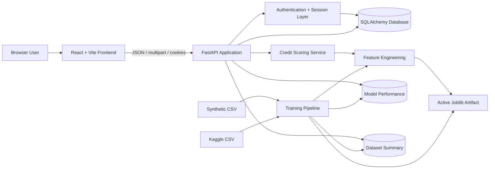

## Runtime request path

```text
React Form
   ↓
FastAPI scoring endpoint
   ↓
Input normalization
   ↓
Feature engineering
   ↓
Active Scikit-learn pipeline
   ↓
Probability
   ↓
Credit score + risk mapping
   ↓
Business-factor explanation
   ↓
Optional applicant/assessment persistence
   ↓
React result card / report / history
```

---

# Data and ML Workflow

The backend exposes the same lifecycle in its workflow API:

```text
01  Dataset
02  Data Cleaning
03  Feature Engineering
04  Encoding
05  Feature Scaling
06  78/22 Stratified Split
07  Model Training
08  Model Evaluation
09  Best Model Selection
10  Prediction API
11  Live Credit Assessment
```

Training also persists:

- model version,
- all major validation metrics,
- confusion matrix,
- downsampled ROC curve coordinates,
- downsampled precision-recall coordinates,
- top feature importance,
- dataset record count,
- feature count,
- training duration,
- numerical summaries,
- categorical summaries,
- target distribution,
- correlation matrix data.

---

# Authentication and Persistence

## Password security

Passwords are not stored directly. The backend uses:

```text
PBKDF2-HMAC-SHA256
390,000 iterations
random 16-byte salt
constant-time verification
```

## Session design

When a user signs in:

1. The server generates a cryptographically random token.
2. Only the SHA-256 digest of that token is stored in the `sessions` table.
3. The raw token is returned as the `credora_session` cookie.
4. The cookie is configured `HttpOnly` and `SameSite=Lax`.
5. The frontend sends authenticated requests with `credentials: "include"`.
6. Sign-out removes the server-side session and deletes the browser cookie.

For a production HTTPS deployment, see [Production Hardening](#production-hardening).

## Persistent records

SQLite is the default storage engine. The data layer is built through SQLAlchemy and can be configured through `DATABASE_URL`.

Persisted entities include:

- users,
- session tokens,
- applicants,
- assessments,
- model-performance evidence,
- dataset summaries,
- user preferences.

Profile image uploads are written under `backend/uploads/` and are ignored by Git.

---

# Technology Stack

| Layer | Technology |
|---|---|
| **Frontend** | React 18, Vite 5, Lucide React, custom CSS |
| **API** | FastAPI |
| **ASGI Server** | Uvicorn |
| **Validation** | Pydantic v2 |
| **ORM** | SQLAlchemy 2 |
| **Default Database** | SQLite |
| **ML** | Scikit-learn |
| **Data** | Pandas, NumPy |
| **Serialization** | Joblib |
| **Testing** | Pytest |
| **Backend container** | Python 3.12 slim |
| **Frontend container** | Node 22 Alpine → Nginx |

---

# Project Structure

```text
CodeAlpha_Credit Scoring Model/
│
├── README.md
├── docker-compose.yml
├── .gitignore
├── credora_credit_scoring_model.py
├── Credora_AI_Dashboard.html
│
├── backend/
│   ├── Dockerfile
│   ├── requirements.txt
│   ├── .env.example
│   ├── TRAIN_SYNTHETIC.cmd
│   ├── TRAIN_SYNTHETIC.ps1
│   ├── TRAIN_KAGGLE.cmd
│   ├── TRAIN_KAGGLE.ps1
│   │
│   ├── app/
│   │   ├── __init__.py
│   │   ├── main.py
│   │   ├── config.py
│   │   ├── database.py
│   │   ├── models.py
│   │   ├── schemas.py
│   │   ├── security.py
│   │   ├── init_db.py
│   │   └── ml/
│   │       ├── __init__.py
│   │       ├── features.py
│   │       ├── train.py
│   │       └── service.py
│   │
│   ├── artifacts/
│   │   ├── active_model.joblib
│   │   ├── logistic_regression.joblib
│   │   ├── decision_tree.joblib
│   │   └── random_forest.joblib
│   │
│   ├── data/
│   │   ├── credit_dataset.csv
│   │   ├── kaggle_credit_risk_dataset.csv
│   │   └── README_DATASETS.md
│   │
│   └── tests/
│       └── test_core.py
│
└── frontend/
    ├── Dockerfile
    ├── package.json
    ├── package-lock.json
    ├── .env.example
    ├── index.html
    └── src/
        ├── api.js
        ├── main.jsx
        ├── styles.css
        └── assets/
            └── credora-logo.png
```

---

# REST API Reference

FastAPI also provides interactive OpenAPI documentation at:

```text
http://127.0.0.1:8000/docs
```

## Health and authentication

| Method | Endpoint | Purpose |
|---|---|---|
| `GET` | `/api/health` | Backend/database/model readiness |
| `POST` | `/api/auth/register` | Create account |
| `POST` | `/api/auth/login` | Start authenticated session |
| `POST` | `/api/auth/logout` | Destroy session |
| `GET` | `/api/auth/me` | Return current user |
| `PUT` | `/api/auth/profile` | Update account profile |
| `POST` | `/api/auth/change-password` | Change password |
| `POST` | `/api/auth/profile-image` | Upload profile image |

## Settings and scoring

| Method | Endpoint | Purpose |
|---|---|---|
| `GET` | `/api/settings` | Load account/application settings |
| `PUT` | `/api/settings` | Save preferences |
| `POST` | `/api/settings/change-password` | Settings-based password update |
| `GET` | `/api/scoring/config` | Scoring configuration |
| `POST` | `/api/scoring/predict` | Predict without saving |
| `POST` | `/api/scoring/predict-and-save` | Predict and persist assessment |

## Applicants

| Method | Endpoint | Purpose |
|---|---|---|
| `GET` | `/api/applicants` | Search/list applicants |
| `POST` | `/api/applicants` | Create applicant |
| `GET` | `/api/applicants/{applicant_id}` | Applicant detail |
| `PUT` | `/api/applicants/{applicant_id}` | Update applicant |
| `DELETE` | `/api/applicants/{applicant_id}` | Delete applicant |
| `GET` | `/api/applicants/{applicant_id}/assessments` | Applicant assessment history |

## Assessments and dashboard

| Method | Endpoint | Purpose |
|---|---|---|
| `GET` | `/api/assessments` | List/search assessments |
| `GET` | `/api/assessments/export/csv` | Export assessment history |
| `GET` | `/api/assessments/{assessment_id}` | Assessment detail |
| `DELETE` | `/api/assessments/{assessment_id}` | Delete assessment |
| `GET` | `/api/assessments/{assessment_id}/report` | Printable HTML report |
| `GET` | `/api/dashboard/summary` | Dashboard totals |
| `GET` | `/api/dashboard/risk-distribution` | Risk distribution |
| `GET` | `/api/dashboard/score-distribution` | Credit-score distribution |
| `GET` | `/api/dashboard/assessment-trend` | Assessment trend |
| `GET` | `/api/dashboard/recent-assessments` | Recent records |

## Model intelligence

| Method | Endpoint | Purpose |
|---|---|---|
| `GET` | `/api/models` | All model metrics |
| `GET` | `/api/models/metrics` | Model metric view |
| `GET` | `/api/models/comparison` | Comparison data |
| `GET` | `/api/models/{model_name}/confusion-matrix` | Confusion matrix |
| `GET` | `/api/models/{model_name}/roc-curve` | ROC curve data |
| `GET` | `/api/models/{model_name}/precision-recall` | Precision-recall data |
| `GET` | `/api/models/{model_name}/feature-importance` | Feature importance |
| `POST` | `/api/models/train` | Trigger a training run |
| `PUT` | `/api/models/active` | Update active-model metadata |

## Insights and workflow

| Method | Endpoint | Purpose |
|---|---|---|
| `GET` | `/api/insights/summary` | Dataset-quality summary |
| `GET` | `/api/insights/correlation` | Correlation data |
| `GET` | `/api/insights/{kind}` | Distribution endpoint |
| `GET` | `/api/insights/key-factors` | Top factor summaries |
| `GET` | `/api/workflow/status` | ML workflow status |
| `GET` | `/api/workflow/details` | Workflow detail |

> Authenticated workspace endpoints require the Credora session cookie. Model/dataset endpoints in the supplied implementation should still be reviewed before exposure on a public deployment.

---

# Database Model

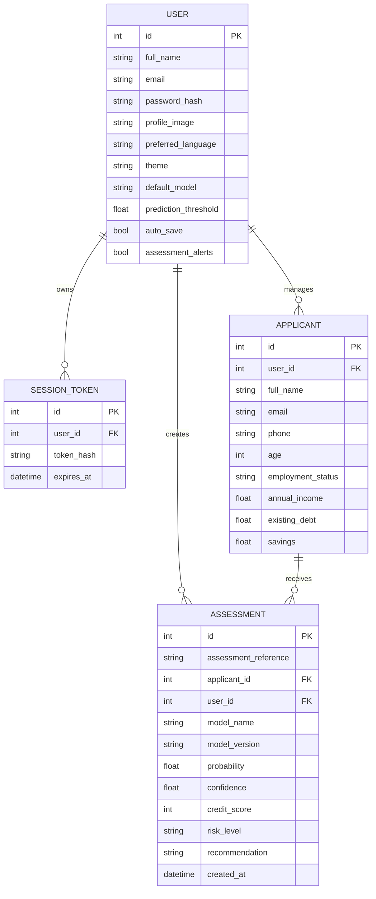

Additional global evidence tables:

```text
model_performances
dataset_summaries
```

---

# Getting Started

## Prerequisites

Recommended local environment:

- **Python 3.12**
- **Node.js 22** (the Docker frontend also builds on Node 22)
- **npm**
- Git
- Optional: Docker Desktop

---

# Run the Application

## Windows PowerShell — recommended local setup

### 1. Backend

From the repository root:

```powershell
cd backend
py -m venv .venv
.\.venv\Scripts\Activate.ps1
python -m pip install --upgrade pip
pip install -r requirements.txt
```

Train the included 2,600-record synthetic dataset:

```powershell
python -m app.ml.train --dataset synthetic
```

Run the API:

```powershell
uvicorn app.main:app --reload --host 127.0.0.1 --port 8000
```

The backend is now available at:

```text
API:      http://127.0.0.1:8000
Swagger:  http://127.0.0.1:8000/docs
Health:   http://127.0.0.1:8000/api/health
```

### 2. Frontend

Open a **second terminal**:

```powershell
cd frontend
npm config set registry https://registry.npmjs.org/
npm install --no-audit --no-fund
npm run dev
```

Open:

```text
http://127.0.0.1:5173
```

A fresh database has no seeded user. Click **Create account** and register your first workspace account.

---

## macOS / Linux

### Backend

```bash
cd backend
python3 -m venv .venv
source .venv/bin/activate
python -m pip install --upgrade pip
pip install -r requirements.txt
python -m app.ml.train --dataset synthetic
uvicorn app.main:app --reload --host 127.0.0.1 --port 8000
```

### Frontend

```bash
cd frontend
npm install
npm run dev
```

---

## Automatic bootstrap behaviour

The FastAPI startup hook already:

1. creates database tables,
2. generates the default synthetic dataset if the configured dataset is missing,
3. trains models when an active artifact or stored model metrics do not exist,
4. loads the active model into the inference service.

Therefore this also works after dependency installation:

```powershell
uvicorn app.main:app --reload --port 8000
```

Running training explicitly first is recommended for a portfolio/demo environment because you can see exactly which dataset and model results are active.

---

## Explicit database bootstrap

The repository also contains:

```powershell
cd backend
python -m app.init_db
```

`app.init_db` creates all SQLAlchemy tables and immediately runs model training with the configured/default dataset.

---

# Dataset and Training Commands

Run these commands from `backend/`.

## Synthetic dataset

```powershell
python -m app.ml.train --dataset synthetic
```

Equivalent helper scripts:

```powershell
.\TRAIN_SYNTHETIC.ps1
```

or:

```cmd
TRAIN_SYNTHETIC.cmd
```

## Included Kaggle dataset

```powershell
python -m app.ml.train --dataset kaggle
```

Equivalent helpers:

```powershell
.\TRAIN_KAGGLE.ps1
```

or:

```cmd
TRAIN_KAGGLE.cmd
```

## Custom CSV

```powershell
python -m app.ml.train --dataset "C:\path\to\credit_dataset.csv"
```

The custom dataset must expose a supported target alias such as:

```text
target
creditworthy
loan_status
good_credit
risk
```

and should contain enough of the supported source columns to build the operational feature set.

## Default active dataset

Without a dataset argument:

```powershell
python -m app.ml.train
```

the trainer resolves the `DATASET_PATH` configuration. The built-in default is:

```text
backend/data/credit_dataset.csv
```

---

# Testing and Validation

The supplied backend test suite validates:

- score conversion bounds,
- risk-band mapping,
- safe ratio engineering,
- prediction response shape.

Run:

```powershell
cd backend
python -m pytest -q
```

Verified against the supplied project snapshot:

```text
4 passed
```

## Frontend production build

```powershell
cd frontend
npm run build
```

Preview the compiled build locally:

```powershell
npm run preview
```

---

# Environment Configuration

Backend defaults are defined in `backend/app/config.py`.

`backend/.env.example` documents:

```env
DATABASE_URL=sqlite:///./data/credora.db
SECRET_KEY=change-this-secret-key-before-production
ACCESS_TOKEN_EXPIRE_MINUTES=10080
MODEL_DIRECTORY=./artifacts
DATASET_PATH=./data/credit_dataset.csv
CORS_ORIGINS=http://localhost:5173,http://127.0.0.1:5173
```

Frontend:

```env
VITE_API_BASE=http://127.0.0.1:8000
```

## Launch Uvicorn with an environment file

If you copy the backend example to `.env`, load it explicitly when starting Uvicorn:

```powershell
cd backend
Copy-Item .env.example .env
uvicorn app.main:app --reload --port 8000 --env-file .env
```

On macOS/Linux:

```bash
cp .env.example .env
uvicorn app.main:app --reload --port 8000 --env-file .env
```

The training module itself reads operating-system environment variables through `os.getenv`; its `--dataset` argument is the clearest way to select a training dataset.

---

# Docker

From the repository root:

```powershell
docker compose up --build
```

Services:

```text
Frontend: http://localhost:8080
Backend:  http://localhost:8000
API docs: http://localhost:8000/docs
```

Stop the stack:

```powershell
docker compose down
```

---

# Repository Hygiene

The supplied `.gitignore` already excludes the heavy/generated paths that should not be uploaded manually to GitHub:

```text
backend/venv/
venv/
.venv/
frontend/node_modules/
node_modules/
frontend/dist/
dist/
.env
backend/.env
frontend/.env
backend/data/credora.db
*.db
backend/uploads/
__pycache__/
.pytest_cache/
```

This means you should **not** upload `node_modules`, virtual environments, local database files or user-uploaded profile images.

For a normal repository upload, commit the source files, datasets you are permitted to distribute, model artifacts you intentionally want to version, screenshots and README.

---

# Production Hardening

Credora is a strong portfolio/engineering demonstration, but a real financial deployment requires additional controls.

Before production use:

1. Serve frontend and API through HTTPS.
2. Set authentication cookies with `secure=True` in HTTPS environments.
3. Add CSRF protection for state-changing cookie-authenticated requests.
4. Move secrets and production configuration to a managed secret store.
5. Use PostgreSQL or another managed database instead of local SQLite.
6. Add schema migrations such as Alembic.
7. Restrict model-training/model-management endpoints to an explicit admin role.
8. Enforce file-size/type limits and image validation on profile uploads.
9. Add request rate limiting, audit logging and security monitoring.
10. Add frontend/backend integration tests and end-to-end tests.
11. Add model drift, calibration and data-quality monitoring.
12. Version datasets, feature definitions and trained artifacts together.
13. Add explainability/fairness evidence that is appropriate to the intended jurisdiction.
14. Establish human review and appeal workflows before any real credit decision is made.

No claim of regulatory compliance is made by this repository.

---

# Responsible ML and Fairness

Credit decisions are a **high-impact domain**. Credora should be treated as an educational/portfolio risk-analysis system unless it has undergone the legal, statistical, fairness and operational validation required for a real deployment.

Important considerations:

- The application outputs analytical recommendations, not legally binding lending decisions.
- Model probability is not the same as a calibrated probability of repayment in every population.
- Score/risk thresholds in this repository are application-defined demonstration rules.
- Training data may contain historical, sampling or representation bias.
- Performance metrics should be evaluated separately across relevant groups before any consequential use.
- Features that may be sensitive or legally restricted in a lending context require special review. The current project schema includes `gender`; a real lending implementation should determine, with qualified legal/compliance guidance, whether such attributes should be excluded from decision features and retained only for permitted fairness auditing.
- False positives and false negatives have different human consequences and should be reviewed separately.
- Model selection by aggregate ROC-AUC alone is not sufficient governance for real lending.
- Human review, explainability, adverse-action processes, monitoring and appeal mechanisms would be required for serious operational use.

The generated report itself includes a responsible-use disclaimer:

> Credora provides analytical recommendations only. It is not a legally binding lending decision.

---

# Author

<div align="center">

### Muhammad Saad Jadoon

**AI / Machine Learning Developer · Full-Stack Developer**

Credora was developed as an end-to-end machine-learning internship project and expanded into a complete risk-intelligence application covering feature engineering, model benchmarking, FastAPI services, SQLAlchemy persistence, secure authentication, React/Vite product development, analytics and responsible ML presentation.

</div>

### Engineering Scope

Built as an end-to-end demonstration of:

```text
Machine Learning
Feature Engineering
Model Evaluation
FastAPI
SQLAlchemy
Authentication
React
Vite
Data Visualization
Operational ML UX
```

---

<div align="center">

## Credora

### Build the model. Validate the evidence. Make the workflow usable.

**Risk Intelligence · Full-Stack ML · Model Transparency**

[Back to top](#top)

</div>
