<a id="top"></a>

<div align="center">


# HeartTrack

### Smart Heart Risk Intelligence

**A complete machine-learning product for guided cardiovascular risk assessment, calibrated prediction, model transparency, and responsible result interpretation.**

HeartTrack combines a polished React workspace, a FastAPI inference service, reproducible model training, secure session authentication, explainable prediction summaries, dataset intelligence, and model evaluation in one coherent full-stack application.

<p>
  
  
  
  
</p>

<p>
  
  
  
  
  
  
  
  
</p>

**[Product Tour](#product-tour) · [ML Engine](#machine-learning-engine) · [Architecture](#system-architecture) · [Security](#privacy--security) · [Setup](#getting-started) · [API](#api-surface) · [Responsible Use](#responsible-use)**

</div>

---

<a href="./docs/showcase/hearttrack-product-showcase.png">
  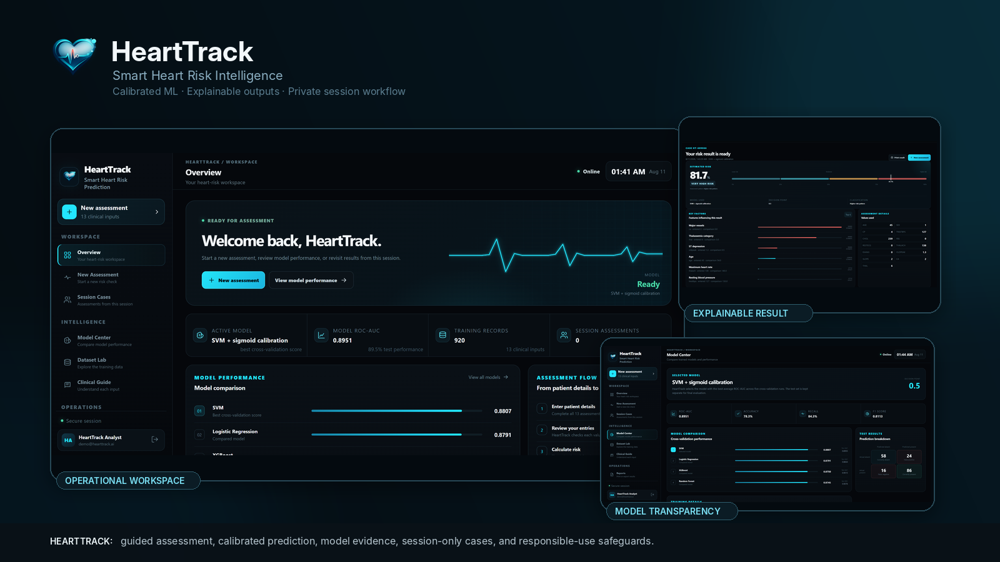
</a>

<p align="center">
  <sub><strong>HeartTrack:</strong> guided clinical-style input, calibrated machine-learning inference, explainable local feature comparisons, model evidence, dataset inspection, session-only cases, and privacy-aware account access in one focused product.</sub>
</p>

---

## Table of Contents

- [Overview](#overview)
- [Why HeartTrack Stands Out](#why-hearttrack-stands-out)
- [Product Tour](#product-tour)
- [Core Capabilities](#core-capabilities)
- [Machine Learning Engine](#machine-learning-engine)
- [Model Evaluation](#model-evaluation)
- [Explainability Design](#explainability-design)
- [Dataset](#dataset)
- [System Architecture](#system-architecture)
- [Technology Stack](#technology-stack)
- [Repository Structure](#repository-structure)
- [Getting Started](#getting-started)
- [Running the Application](#running-the-application)
- [Reproducible Training](#reproducible-training)
- [Validation & CI](#validation--ci)
- [API Surface](#api-surface)
- [Privacy & Security](#privacy--security)
- [Configuration](#configuration)
- [Responsible Use](#responsible-use)
- [Documentation](#documentation)

---

## Overview

**HeartTrack** is an end-to-end machine-learning application for exploring how structured cardiovascular features can be transformed into a model-based heart-disease probability estimate.

It is intentionally built as a **complete product rather than a notebook-only classifier**. The repository connects the entire workflow:

> **Authenticate → enter 13 structured features → validate inputs → run calibrated inference → inspect probability and risk band → review local feature influences → compare models → inspect the training data → export session results.**

The application includes:

- a modern responsive **React 19 + Vite** frontend;
- a typed **FastAPI + Pydantic** backend;
- a reproducible **scikit-learn / XGBoost** training pipeline;
- candidate-model comparison using **five-fold cross-validated ROC-AUC**;
- post-selection **sigmoid probability calibration**;
- a protected prediction endpoint using **HttpOnly cookie sessions**;
- a model center exposing real evaluation evidence;
- a dataset lab exposing cohort composition, missingness, and feature definitions;
- guided multi-step assessment entry;
- local feature influence summaries for each prediction;
- session-only case tracking and export;
- automated backend tests and GitHub Actions CI.

> [!IMPORTANT]
> HeartTrack is an **educational and informational machine-learning project**. It is **not a medical device**, has **not been clinically validated**, and must not be used for diagnosis, treatment, triage, emergency decisions, or as a substitute for qualified medical care.

### Project at a glance

| Area | Implementation |
|---|---|
| **Frontend** | React 19.2 + React Router 7 + Vite 8 |
| **Backend** | FastAPI + Pydantic + Uvicorn |
| **ML stack** | scikit-learn + XGBoost + pandas + NumPy |
| **Candidate models** | Logistic Regression, SVM, Random Forest, XGBoost |
| **Selection rule** | Best mean 5-fold CV ROC-AUC on the training partition |
| **Selected artifact** | SVM + sigmoid calibration |
| **Holdout ROC-AUC** | **0.8951** calibrated |
| **Training records** | **920** |
| **Predictive inputs** | **13** structured clinical features |
| **Authentication** | Signed JWT stored in an HttpOnly SameSite cookie |
| **Password hashing** | Argon2 |
| **Assessment persistence** | Session memory only in the current browser app state |
| **Automation** | pytest + frontend production build through GitHub Actions |

---

## Why HeartTrack Stands Out

<table>
  <tr>
    <td width="25%" valign="top"><strong>🧠 ML engineering, not just inference</strong><br><sub>The repository includes dataset construction, preprocessing, cross-validation, hyperparameter search, model comparison, probability calibration, evaluation, artifacts, runtime loading, and inference.</sub></td>
    <td width="25%" valign="top"><strong>📊 Real model evidence</strong><br><sub>ROC-AUC, accuracy, balanced accuracy, precision, recall, F1, Brier score, classification reports, confusion matrices, model parameters, and split metadata are exported with the trained artifact.</sub></td>
    <td width="25%" valign="top"><strong>🔎 Interpretable result workflow</strong><br><sub>Predictions include calibrated probability, presentation risk band, model identity, threshold, assessment values, and ranked local feature comparisons instead of a bare binary label.</sub></td>
    <td width="25%" valign="top"><strong>🔐 Privacy-aware product design</strong><br><sub>Authentication uses HttpOnly cookies, passwords are Argon2-hashed, and assessment cases remain in the current React session rather than being persisted to browser storage.</sub></td>
  </tr>
</table>

### Engineering decisions worth noticing

- **The holdout set does not choose the winning model.** Candidate selection is based on cross-validated ROC-AUC from the training partition.
- **Probability output is explicitly calibrated.** The selected base estimator is wrapped in `CalibratedClassifierCV(method="sigmoid", cv=5)` before deployment.
- **Preprocessing is inside the model pipeline.** Median imputation and scaling are attached to the estimator, reducing train/serve mismatch.
- **Input contracts are validated before inference.** Pydantic constrains valid numeric ranges and category values at the API boundary.
- **Model artifacts carry runtime metadata.** Feature order, reference values, decision threshold, selected model, dataset size, and timestamp ship with the serialized bundle.
- **Explainability is presented responsibly.** Local influence values are counterfactual comparisons, not causal claims.

---

<a id="product-tour"></a>
## Product Tour

The screenshots below follow the actual user journey from secure access to assessment, model inference, evidence review, and session operations.

### 1. Secure entry and account creation

<table>
<tr>
<td width="50%" valign="top">
<a href="./docs/screenshots/01-sign-in.png">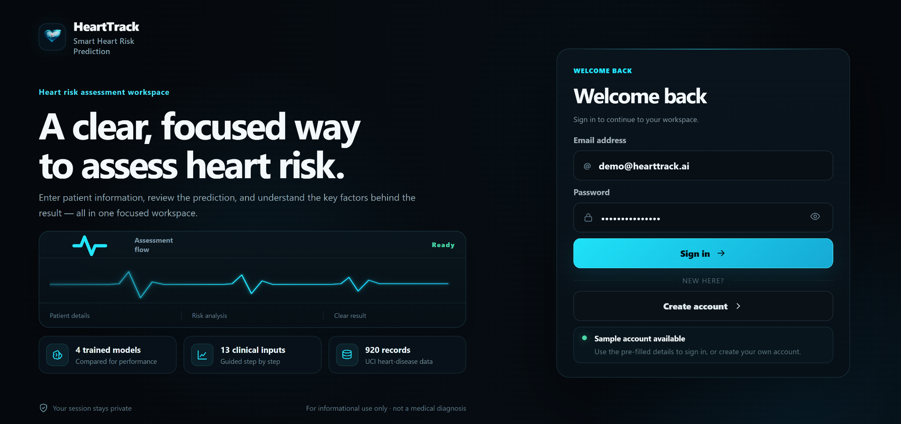</a>
<br><sub><strong>Secure Sign In</strong> — focused access screen, pre-filled development demo account, protected-session messaging, and direct account creation.</sub>
</td>
<td width="50%" valign="top">
<a href="./docs/screenshots/02-create-account.png">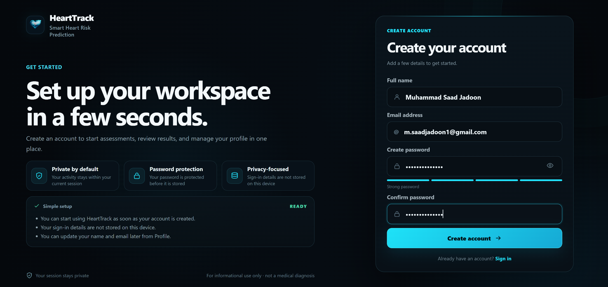</a>
<br><sub><strong>Create Account</strong> — validated name, email, password, confirmation, and password-strength feedback in the same visual system.</sub>
</td>
</tr>
</table>

---

### 2. Operational workspace

<a href="./docs/screenshots/03-overview.png">
  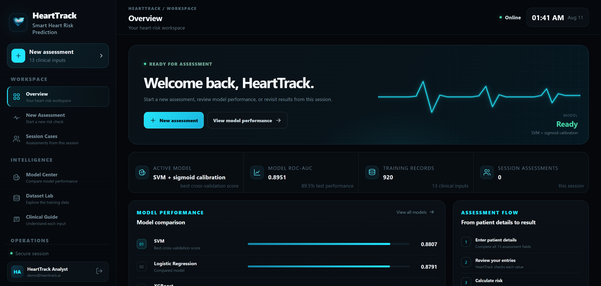
</a>

<p align="center"><sub><strong>Overview:</strong> active model, test ROC-AUC, dataset size, current-session activity, assessment flow, model comparison, and training-data context are visible before the user starts a new case.</sub></p>

<a href="./docs/screenshots/04-overview-intelligence.png">
  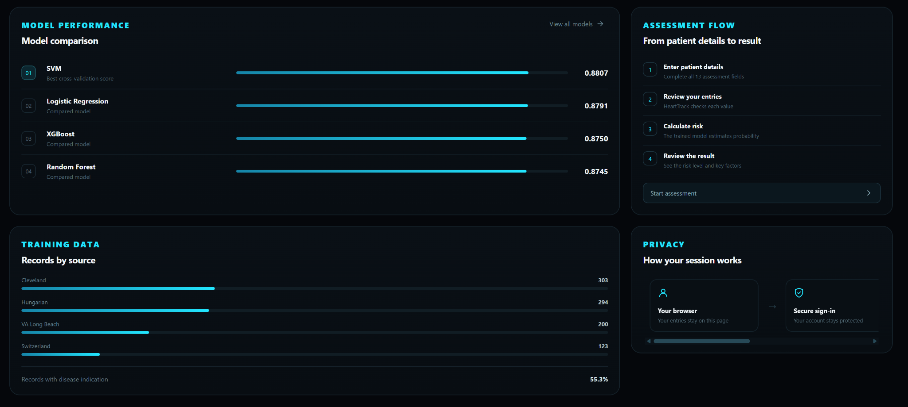
</a>

---

### 3. Guided 13-input assessment

The assessment UI divides the model inputs into four logical stages so users are not presented with a single dense form.

<table>
<tr>
<td width="50%" valign="top">
<a href="./docs/screenshots/05-new-assessment-step-1.png">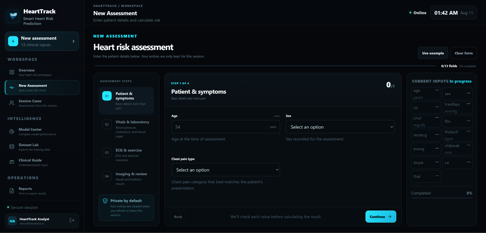</a>
<br><sub><strong>Step 1 · Patient & Symptoms</strong> — age, sex, and chest-pain category with live completion state and input guidance.</sub>
</td>
<td width="50%" valign="top">
<a href="./docs/screenshots/17-new-assessment-step-4.png">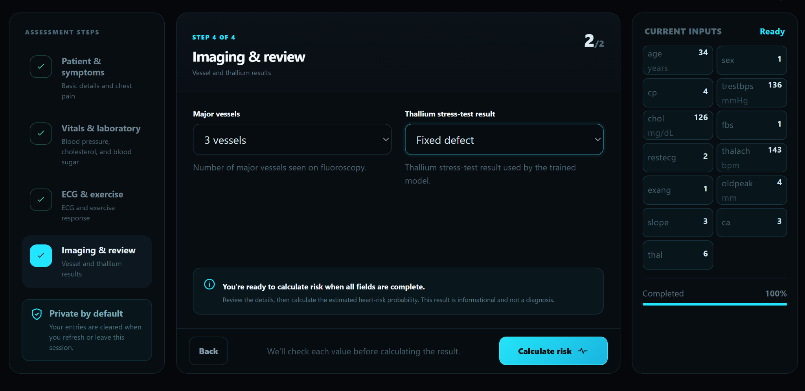</a>
<br><sub><strong>Step 4 · Imaging & Review</strong> — final vessel and thallium inputs, complete 13-feature summary, and explicit calculate action.</sub>
</td>
</tr>
</table>

The four stages are:

1. **Patient & symptoms** — age, sex, chest-pain category.
2. **Vitals & laboratory** — resting blood pressure, cholesterol, fasting blood sugar.
3. **ECG & exercise** — resting ECG, maximum heart rate, exercise-induced angina, ST depression, slope.
4. **Imaging & review** — number of major vessels and thallium stress-test result.

---

### 4. Explainable prediction result

<a href="./docs/screenshots/06-risk-result-very-high.png">
  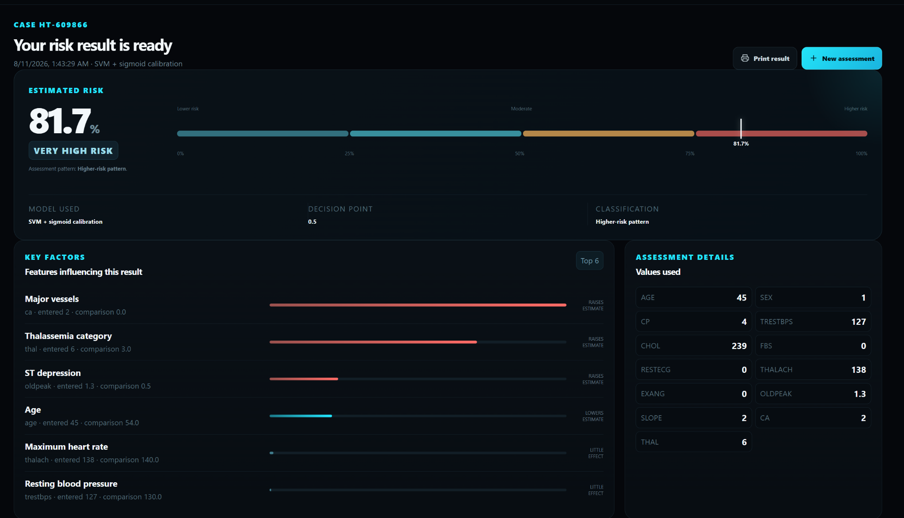
</a>

<p align="center"><sub><strong>Prediction Result:</strong> calibrated probability, presentation risk band, decision point, model identity, ranked local feature influences, and the exact submitted values are shown together.</sub></p>

A second example demonstrates how the same interface behaves for a different feature combination:

<a href="./docs/screenshots/18-risk-result-high.png">
  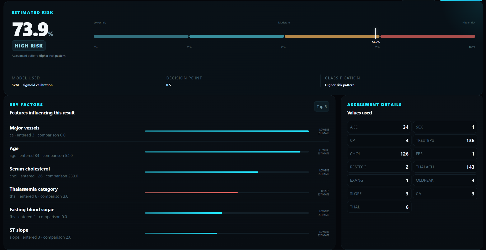
</a>

---

### 5. Model transparency

<a href="./docs/screenshots/08-model-center.png">
  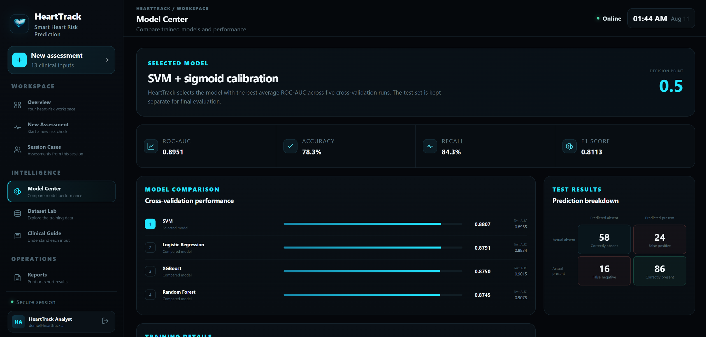
</a>

<p align="center"><sub><strong>Model Center:</strong> selected estimator, decision point, calibrated holdout metrics, cross-validation ranking, test ROC-AUC values, and confusion-matrix counts are surfaced directly in the product.</sub></p>

---

### 6. Dataset intelligence and field-level guidance

<table>
<tr>
<td width="50%" valign="top">
<a href="./docs/screenshots/09-dataset-lab.png">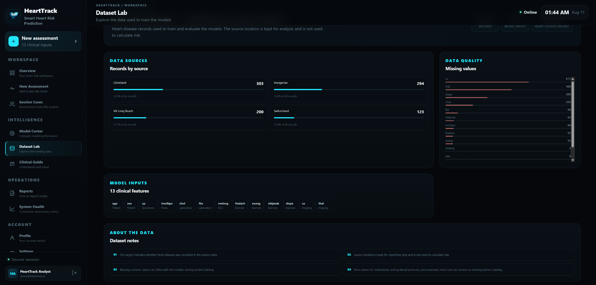</a>
<br><sub><strong>Dataset Lab</strong> — source cohorts, record counts, missing-value profile, the 13 model features, and data notes.</sub>
</td>
<td width="50%" valign="top">
<a href="./docs/screenshots/10-clinical-guide-1.png">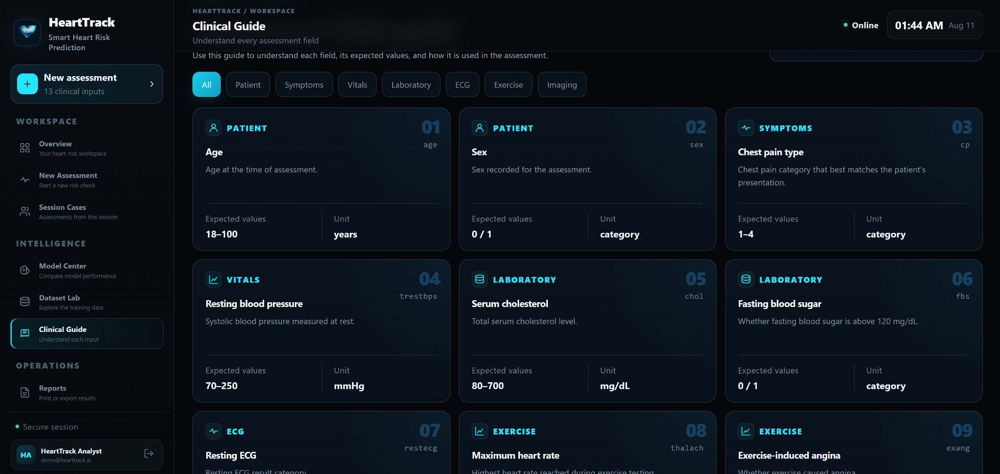</a>
<br><sub><strong>Clinical Guide</strong> — expected ranges, units, categories, field codes, and plain-language descriptions for every input.</sub>
</td>
</tr>
</table>

---

### 7. Session cases, reporting, and system status

<table>
<tr>
<td width="33%" valign="top">
<a href="./docs/screenshots/07-session-cases.png">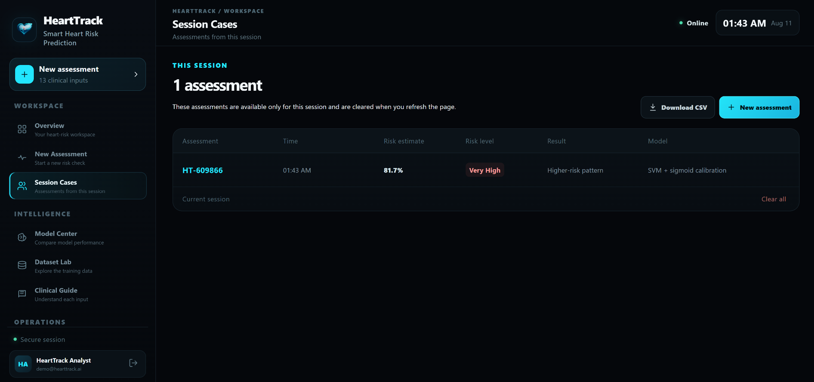</a>
<br><sub><strong>Session Cases</strong><br>Current-session assessments with case ID, probability, band, result, model, CSV export, and clear-all control.</sub>
</td>
<td width="33%" valign="top">
<a href="./docs/screenshots/12-reports.png">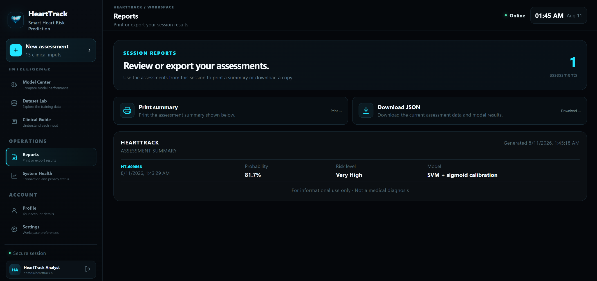</a>
<br><sub><strong>Reports</strong><br>Printable assessment summary and downloadable JSON for the active session result.</sub>
</td>
<td width="34%" valign="top">
<a href="./docs/screenshots/13-system-health.png">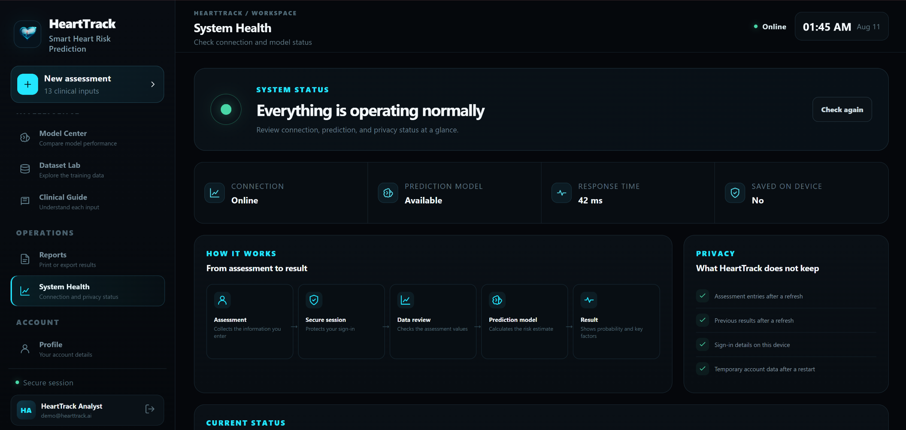</a>
<br><sub><strong>System Health</strong><br>Backend connectivity, model availability, response time, device-persistence status, and privacy workflow.</sub>
</td>
</tr>
</table>

<details>
<summary><strong>Open the extended interface gallery</strong></summary>
<br>

#### Complete clinical guide

<a href="./docs/screenshots/11-clinical-guide-2.png">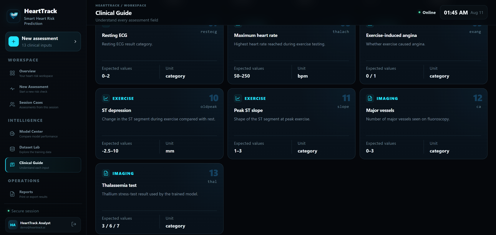</a>

#### Profile

<a href="./docs/screenshots/14-profile.png">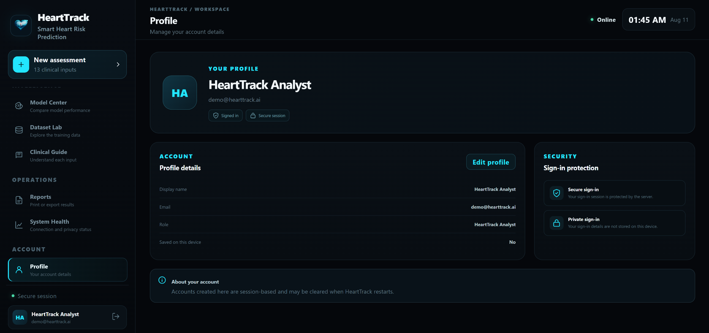</a>

#### Workspace settings

<a href="./docs/screenshots/15-settings.png">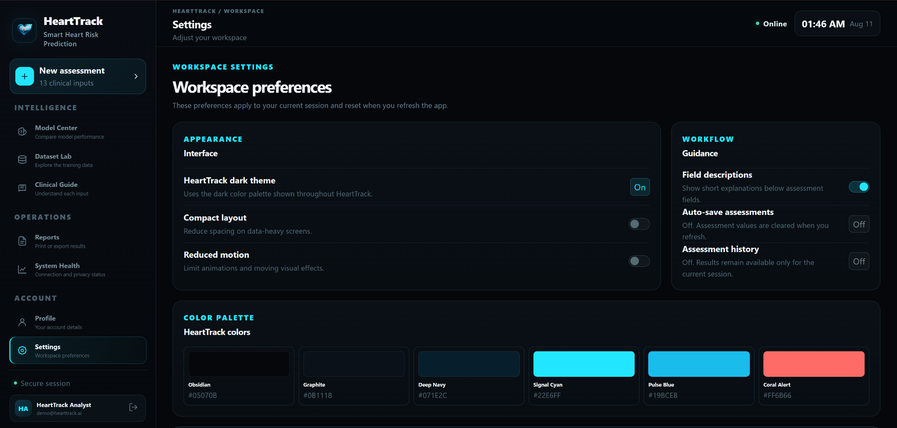</a>

#### Overview after an assessment

<a href="./docs/screenshots/16-overview-with-assessment.png">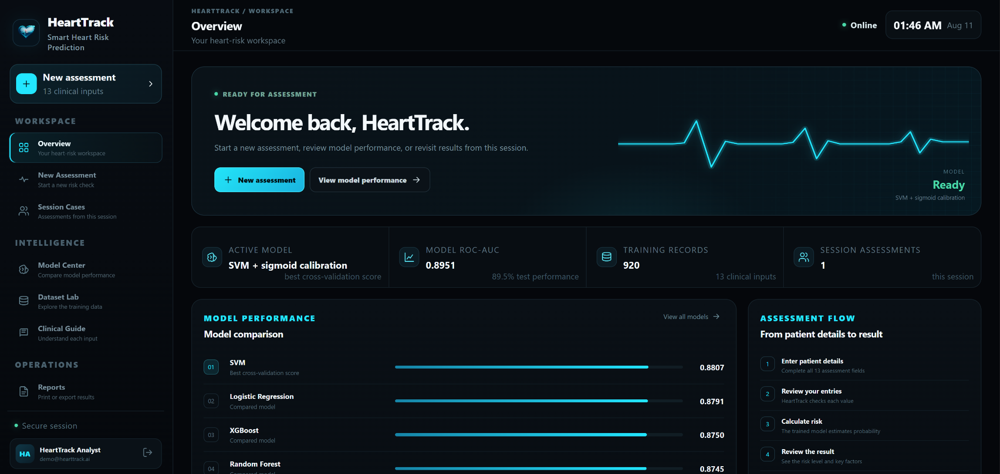</a>

</details>

<p align="right"><a href="#top">Back to top ↑</a></p>

---

## Core Capabilities

### ❤️ Guided heart-risk assessment

- Four-stage workflow covering all **13 trained model inputs**.
- Live completion tracking and review panel.
- Range-constrained numeric inputs and valid categorical options.
- Built-in example data for fast demonstration.
- Clear explanatory text below assessment fields.
- Final review before model inference.

### 🧠 Machine-learning inference

- Server-side prediction through a protected FastAPI endpoint.
- Loaded serialized calibrated model bundle via `joblib`.
- Probability output from `predict_proba`.
- Binary decision based on the model bundle's threshold.
- User-facing Low / Moderate / High / Very High presentation bands.
- Active model name and threshold returned with each result.

### 🔎 Result explanation

- Calibrated probability and percent display.
- Model classification and risk presentation band.
- Top six local feature comparisons ranked by absolute probability impact.
- Submitted value and model reference value shown together.
- Direction indicator: `higher`, `lower`, or `neutral` relative to the original estimate.
- Explicit non-diagnostic disclaimer returned by the prediction service.

### 📊 Model intelligence

- Selected model and calibration strategy.
- Cross-validation ROC-AUC comparison across four candidate algorithms.
- Holdout ROC-AUC, accuracy, balanced accuracy, precision, recall, F1, and Brier score.
- Confusion matrix and classification report.
- Hyperparameter-search outputs.
- Training/test split metadata and runtime-library versions.

### 🧬 Dataset intelligence

- UCI cohort source breakdown.
- Missing-value statistics.
- Training-data summary.
- Full 13-feature glossary.
- Data-quality notes.
- Cohort source retained for analysis but excluded from predictive features.

### 🔐 Account and session workflow

- Registration and sign-in.
- Password validation.
- Argon2 password hashing.
- Signed JWT session token in an HttpOnly cookie.
- SameSite `lax` cookie policy.
- Profile update support.
- Session logout and cookie deletion.
- Runtime-created accounts held in server memory in the current implementation.

### 📁 Session operations

- Current-session case list.
- CSV export of session assessments.
- Printable result summary.
- JSON result export.
- Session clear-all control.
- No browser local-storage persistence for assessment cases.

---

<a id="machine-learning-engine"></a>
## Machine Learning Engine

HeartTrack's training pipeline is designed to make model selection reproducible and inspectable.

### Candidate algorithms

| Candidate | Preprocessing | Search / training behavior |
|---|---|---|
| **Logistic Regression** | Median imputation + StandardScaler | Balanced classes; `C` and solver search |
| **Support Vector Machine** | Median imputation + StandardScaler | RBF kernel; `C` and `gamma` search; probability output enabled |
| **Random Forest** | Median imputation | Estimator count, depth, leaves, feature strategy search |
| **XGBoost** | Median imputation | Trees, depth, learning rate, sampling, regularization search |

### Training strategy

```text
Raw UCI cohorts
      │
      ▼
Dataset normalization + binary target
      │
      ▼
Stratified 80 / 20 train-holdout split
      │
      ├────────────── Holdout kept separate from selection
      │
      ▼
5-fold StratifiedKFold on training partition
      │
      ▼
RandomizedSearchCV for each candidate model
      │
      ▼
Select highest mean CV ROC-AUC
      │
      ▼
Refit selected estimator through sigmoid calibration
      │
      ▼
Evaluate calibrated artifact on untouched holdout
      │
      ▼
Export model bundle + metrics + dataset report
```

### Selection rule

The current artifact selects the candidate with the highest mean ROC-AUC across the five cross-validation folds.

That distinction matters because the **holdout set remains a final evaluation set instead of becoming another hyperparameter-selection surface**.

The included training run selected:

> **SVM + sigmoid calibration**

---

<a id="model-evaluation"></a>
## Model Evaluation

### Calibrated deployed artifact

| Metric | Value |
|---|---:|
| **ROC-AUC** | **0.8951** |
| **Accuracy** | **78.26%** |
| **Balanced Accuracy** | **77.52%** |
| **Precision** | **78.18%** |
| **Recall** | **84.31%** |
| **F1 Score** | **0.8113** |
| **Brier Score** | **0.1343** |
| **Decision Threshold** | **0.50** |

### Holdout confusion matrix

|  | Predicted Absent | Predicted Present |
|---|---:|---:|
| **Actual Absent** | **58** | **24** |
| **Actual Present** | **16** | **86** |

### Candidate comparison

| Model | Mean CV ROC-AUC | Holdout ROC-AUC | Role |
|---|---:|---:|---|
| **SVM** | **0.8807** | **0.8955** | Selected by CV |
| Logistic Regression | 0.8791 | 0.8834 | Compared |
| XGBoost | 0.8750 | 0.9015 | Compared |
| Random Forest | 0.8745 | 0.9078 | Compared |

> [!NOTE]
> Random Forest and XGBoost achieve higher ROC-AUC values on this particular holdout than the SVM base estimator, but they are **not selected from holdout performance**. The repository's selection rule uses mean cross-validation ROC-AUC on the training partition, which selected SVM.

### Split design

| Property | Value |
|---|---:|
| Total records | 920 |
| Training records | 736 |
| Holdout records | 184 |
| Holdout fraction | 20% |
| Stratified | Yes |
| Random state | 42 |

---

## Explainability Design

HeartTrack's local feature influence panel is intentionally simple and inspectable.

For each submitted feature:

1. The service calculates the original prediction probability.
2. One feature is replaced with its training-reference value.
3. Probability is recalculated with all other submitted values unchanged.
4. The probability difference becomes that feature's local comparison score.
5. Features are sorted by absolute impact and the top six are returned.

Reference values are generated from the training partition:

- **median** for continuous features;
- **mode** for categorical features.

This provides a compact answer to:

> *“How does this submitted value compare with the model's reference value for this one prediction?”*

It does **not** establish causality, clinical importance, or treatment relevance.

---

## Dataset

HeartTrack uses the processed **UCI Heart Disease** cohorts included in the repository.

| Cohort | Records |
|---|---:|
| Cleveland | 303 |
| Hungarian | 294 |
| VA Long Beach | 200 |
| Switzerland | 123 |
| **Total** | **920** |

### Predictive features

| Code | Feature | Product grouping |
|---|---|---|
| `age` | Age | Patient |
| `sex` | Sex | Patient |
| `cp` | Chest pain type | Symptoms |
| `trestbps` | Resting blood pressure | Vitals |
| `chol` | Serum cholesterol | Laboratory |
| `fbs` | Fasting blood sugar indicator | Laboratory |
| `restecg` | Resting ECG result | ECG |
| `thalach` | Maximum heart rate achieved | Exercise |
| `exang` | Exercise-induced angina | Exercise |
| `oldpeak` | ST depression | Exercise |
| `slope` | ST-segment slope | Exercise |
| `ca` | Number of major vessels | Imaging |
| `thal` | Thallium / thalassemia category | Imaging |

### Target preparation

The historical disease-severity value is converted to a binary target:

- `0` — no recorded heart disease;
- `1` — recorded heart disease.

The source cohort is preserved for reporting but is **not used as a predictive feature**.

### Missing-data handling

- Historical missing values are retained in the source data.
- Numeric predictors are imputed with the **median inside the scikit-learn pipeline**.
- Selected zero-valued clinical measurements are treated as missing before training where appropriate.

See [`docs/DATASET.md`](docs/DATASET.md) for the repository's data notes.

---

<a id="system-architecture"></a>
## System Architecture

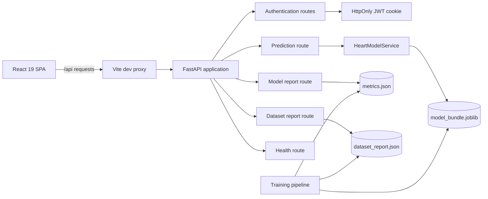

### Runtime request path

```text
Browser
  │
  ├─ React Router protected workspace
  │
  ├─ fetch(..., credentials="include")
  │
  ▼
/api
  │
  ▼
FastAPI
  │
  ├─ validates authentication cookie
  ├─ validates request with Pydantic
  └─ loads cached HeartModelService
          │
          ▼
  calibrated model bundle
          │
          ├─ probability
          ├─ threshold classification
          ├─ presentation risk band
          └─ local feature comparisons
```

### Session-data design

The current UI keeps assessment cases in React state:

```text
SessionProvider
  ├── draft
  ├── current-session cases
  └── last result
```

Refreshing or leaving the current browser session clears that assessment state. The application does not use browser `localStorage` for case persistence.

---

## Technology Stack

| Layer | Technology | Purpose |
|---|---|---|
| **UI** | React 19.2 | Component-driven application interface |
| **Routing** | React Router 7.9 | Protected application navigation |
| **Build tooling** | Vite 8 | Development server, proxy, production build |
| **API** | FastAPI 0.128 | Typed backend service |
| **Validation** | Pydantic 2.13 | Request/response contracts and bounds |
| **Server** | Uvicorn 0.48 | ASGI runtime |
| **Data** | pandas 2.3 + NumPy 2.3 | Dataset preparation and runtime frames |
| **ML** | scikit-learn 1.8 | Pipelines, CV, calibration, metrics, models |
| **Boosting** | XGBoost 3.4 | Candidate gradient-boosted classifier |
| **Artifact I/O** | joblib 1.5 | Serialized trained bundle |
| **Sessions** | PyJWT | Signed session token |
| **Passwords** | Argon2 | Password hashing |
| **Testing** | pytest + HTTPX | Backend API tests |
| **Automation** | GitHub Actions | Backend tests + frontend build |

---

## Repository Structure

```text
HeartTrack/
├── .github/
│   ├── pull_request_template.md
│   └── workflows/
│       └── ci.yml
├── backend/
│   ├── app/
│   │   ├── routers/
│   │   │   ├── auth.py
│   │   │   ├── health.py
│   │   │   ├── model_info.py
│   │   │   └── prediction.py
│   │   ├── auth.py
│   │   ├── config.py
│   │   ├── main.py
│   │   ├── model_service.py
│   │   └── schemas.py
│   ├── data/
│   │   ├── raw/
│   │   └── processed/
│   ├── ml/
│   │   ├── artifacts/
│   │   │   ├── dataset_report.json
│   │   │   ├── metrics.json
│   │   │   └── model_bundle.joblib
│   │   ├── data.py
│   │   ├── evaluate.py
│   │   ├── predict_cli.py
│   │   └── train.py
│   ├── tests/
│   ├── .env.example
│   └── requirements.txt
├── frontend/
│   ├── src/
│   │   ├── api/
│   │   ├── components/
│   │   ├── context/
│   │   ├── data/
│   │   ├── pages/
│   │   ├── App.jsx
│   │   ├── main.jsx
│   │   └── styles.css
│   ├── .env.example
│   ├── index.html
│   ├── package.json
│   └── vite.config.js
├── docs/
│   ├── ARCHITECTURE.md
│   ├── DATASET.md
│   ├── MODEL_CARD.md
│   ├── brand/
│   ├── screenshots/
│   └── showcase/
├── scripts/
│   ├── run-all.ps1
│   ├── run-backend.ps1
│   ├── run-frontend.ps1
│   └── setup.ps1
├── CONTRIBUTING.md
├── GITHUB_UPLOAD.md
├── QUICK_START.md
├── SECURITY.md
└── README.md
```

---

<a id="getting-started"></a>
## Getting Started

### Requirements

The repository is configured for:

- **Python 3.14.x**
- **Node.js 22.x**
- **npm**
- **Windows PowerShell** for the included helper scripts

The frontend/backend can also be started manually on another operating system, but the included scripts are Windows-first.

### Option A — Complete automated setup

From the repository root in PowerShell:

```powershell
Set-ExecutionPolicy -Scope Process -ExecutionPolicy Bypass
.\scripts\setup.ps1
```

The setup script performs the full development bootstrap:

1. creates a fresh Python 3.14 virtual environment;
2. installs backend dependencies;
3. prepares `.env` files from the included examples;
4. rebuilds the dataset;
5. retrains the full model pipeline;
6. installs frontend dependencies;
7. runs backend tests;
8. runs the frontend production build.

After setup:

```powershell
.\scripts\run-all.ps1
```

Open:

```text
Frontend: http://localhost:5173
API docs: http://localhost:8000/docs
```

### Option B — Manual setup

#### 1. Clone

```bash
git clone <YOUR-REPOSITORY-URL>
cd HeartTrack
```

#### 2. Create the Python environment

```powershell
py -3.14 -m venv .venv
.\.venv\Scripts\Activate.ps1
python -m pip install --upgrade pip setuptools wheel
python -m pip install --only-binary=:all: -r backend\requirements.txt
```

#### 3. Prepare environment files

```powershell
Copy-Item backend\.env.example backend\.env
Copy-Item frontend\.env.example frontend\.env
```

#### 4. Install frontend dependencies

```powershell
cd frontend
npm install
cd ..
```

> [!TIP]
> The repository already contains the processed dataset, evaluation reports, and trained model bundle. Retraining is optional for simply running the application.

---

## Running the Application

### Start the backend

Open terminal 1:

```powershell
.\.venv\Scripts\Activate.ps1
cd backend
python -m uvicorn app.main:app --reload --host 127.0.0.1 --port 8000
```

Useful backend URLs:

```text
API root:  http://127.0.0.1:8000/
Swagger:   http://127.0.0.1:8000/docs
Health:    http://127.0.0.1:8000/api/health
```

### Start the frontend

Open terminal 2:

```powershell
cd frontend
npm run dev
```

Open:

```text
http://localhost:5173
```

### Development demo account

```text
Email:    demo@hearttrack.ai
Password: HeartTrack@2026
```

The demo identity is configured through backend environment variables and can be overridden.

### Helper commands

Backend only:

```powershell
.\scripts\run-backend.ps1
```

Frontend only:

```powershell
.\scripts\run-frontend.ps1
```

Both services:

```powershell
.\scripts\run-all.ps1
```

---

## Reproducible Training

The repository includes both a fast development mode and a full model-selection run.

### Full pipeline

```powershell
.\.venv\Scripts\Activate.ps1
cd backend
python -m ml.data
python -m ml.train --mode full
python -m ml.evaluate
```

### Fast development run

```powershell
.\.venv\Scripts\Activate.ps1
cd backend
python -m ml.data
python -m ml.train --mode fast
python -m ml.evaluate
```

### Generated artifacts

```text
backend/ml/artifacts/model_bundle.joblib
backend/ml/artifacts/metrics.json
backend/ml/artifacts/dataset_report.json
```

The model bundle includes:

- calibrated estimator;
- selected model name;
- original selected base model;
- ordered feature list;
- feature reference values;
- binary decision threshold;
- training timestamp;
- dataset row count;
- random state.

---

## Validation & CI

### Backend test suite

```powershell
.\.venv\Scripts\Activate.ps1
cd backend
python -m pytest -q
```

The current tests cover:

- runtime account registration;
- authenticated profile update;
- logout behavior;
- health/model-ready contract;
- authenticated prediction response contract.

### Frontend production build

```powershell
cd frontend
npm run build
```

### GitHub Actions

The included `.github/workflows/ci.yml` runs on both pushes and pull requests:

```text
Backend job
  ├─ Python 3.14
  ├─ dependency installation
  └─ pytest

Frontend job
  ├─ Node.js 22
  ├─ npm install
  └─ npm run build
```

This keeps the repository presentation aligned with an actual build-and-test workflow instead of documentation-only claims.

---

<a id="api-surface"></a>
## API Surface

| Method | Endpoint | Authentication | Purpose |
|---|---|---:|---|
| `GET` | `/` | No | API metadata |
| `GET` | `/api/health` | No | Service and model readiness |
| `POST` | `/api/auth/register` | No | Create runtime account and session |
| `POST` | `/api/auth/login` | No | Authenticate and issue session cookie |
| `GET` | `/api/auth/me` | Yes | Read current authenticated identity |
| `POST` | `/api/auth/profile` | Yes | Update display name and email |
| `POST` | `/api/auth/logout` | Yes | Clear session cookie |
| `POST` | `/api/prediction/heart` | Yes | Generate calibrated heart-risk estimate |
| `GET` | `/api/models/report` | Yes | Read model metrics and selection evidence |
| `GET` | `/api/models/dataset` | Yes | Read dataset summary and quality report |

### Example prediction request

```json
{
  "age": 54,
  "sex": 1,
  "cp": 3,
  "trestbps": 130,
  "chol": 246,
  "fbs": 0,
  "restecg": 0,
  "thalach": 150,
  "exang": 0,
  "oldpeak": 1.0,
  "slope": 2,
  "ca": 0,
  "thal": 3
}
```

### Response shape

```json
{
  "probability": 0.0,
  "percent": 0.0,
  "predicted_class": 0,
  "risk_level": "Low",
  "model_name": "SVM + sigmoid calibration",
  "threshold": 0.5,
  "influences": [],
  "disclaimer": "..."
}
```

The values above illustrate the response schema only; actual probability and influences depend on the submitted assessment.

---

## Privacy & Security

HeartTrack includes several application-level safeguards appropriate for a serious development project, while also being explicit about what is **not** production-ready.

### Implemented

- Passwords are hashed with **Argon2**.
- Sessions are signed with **HS256 JWT** tokens.
- Session tokens are delivered through an **HttpOnly cookie**.
- Cookies use `SameSite=Lax`.
- `Secure` cookie behavior can be enabled through environment configuration.
- FastAPI CORS allows only the configured frontend origin.
- Prediction, model-report, dataset-report, profile, and identity routes require authentication.
- Assessment cases are held in React session state rather than browser persistence.
- Environment templates are committed instead of real `.env` secrets.
- Production guidance is documented in [`SECURITY.md`](SECURITY.md).

### Current development limitations

- Newly registered accounts are stored **in server memory**, not in a persistent database.
- Restarting the API clears runtime-created accounts.
- Session assessment data is cleared by refresh/restart because it is intentionally non-persistent.
- The default secret and demo credentials are development conveniences and must be replaced for deployment.
- Production deployment would require persistent identity storage, HTTPS, secret management, rate limiting, monitoring, logging, privacy review, and appropriate compliance controls before any sensitive data is handled.

> [!WARNING]
> Do not use this development project to store or process real patient information without an appropriate production security, privacy, legal, and compliance review.

---

## Configuration

### Backend — `backend/.env`

```dotenv
HEARTTRACK_APP_ENV=development
HEARTTRACK_FRONTEND_ORIGIN=http://localhost:5173
HEARTTRACK_SECRET_KEY=replace-with-a-long-random-secret
HEARTTRACK_DEMO_EMAIL=demo@hearttrack.ai
HEARTTRACK_DEMO_PASSWORD=HeartTrack@2026
HEARTTRACK_COOKIE_SECURE=false
HEARTTRACK_SESSION_MINUTES=60
```

### Frontend — `frontend/.env`

```dotenv
VITE_API_BASE=/api
```

During development, Vite proxies `/api` to `http://127.0.0.1:8000`, allowing the frontend and API to work together while preserving cookie credentials through the same frontend origin.

---

<a id="responsible-use"></a>
## Responsible Use

HeartTrack is a machine-learning engineering demonstration built on historical UCI Heart Disease records.

### What the output represents

The application estimates the probability of the **binary target learned from the repository's historical training data**. The Low / Moderate / High / Very High labels are interface bands mapped from model probability.

They are **not clinical risk categories**.

### What the output does not represent

HeartTrack must not be interpreted as:

- a medical diagnosis;
- a validated cardiovascular risk calculator;
- a treatment recommendation;
- a triage or emergency-decision system;
- a replacement for clinician judgment;
- proof that an individual feature caused a result;
- evidence that the model will generalize to every population or clinical environment.

### Dataset and model limitations

- The source records are historical.
- Missingness varies by cohort and feature.
- The combined dataset is relatively small by modern clinical-ML standards.
- Population coverage is limited.
- Probability calibration on the included holdout does not establish calibration in a new population.
- Local influence summaries are one-feature counterfactual comparisons, not causal explanations.

If a person has health concerns, they should consult a qualified healthcare professional.

---

## Documentation

| Document | Purpose |
|---|---|
| [`QUICK_START.md`](QUICK_START.md) | Minimal setup and launch commands |
| [`docs/ARCHITECTURE.md`](docs/ARCHITECTURE.md) | Request flow and system architecture |
| [`docs/DATASET.md`](docs/DATASET.md) | Cohorts, target, features, missingness, limitations |
| [`docs/MODEL_CARD.md`](docs/MODEL_CARD.md) | Model purpose, selection, evaluation, explainability, limitations |
| [`SECURITY.md`](SECURITY.md) | Security design and production considerations |
| [`CONTRIBUTING.md`](CONTRIBUTING.md) | Development contribution workflow |
| [`GITHUB_UPLOAD.md`](GITHUB_UPLOAD.md) | Repository publishing commands |

---

## Suggested Repository Description

```text
Full-stack heart-risk ML application with React, FastAPI, calibrated model selection, explainable predictions, UCI dataset intelligence, and secure session workflows.
```

### Suggested GitHub topics

```text
machine-learning
heart-disease
healthcare-ai
fastapi
react
scikit-learn
xgboost
python
vite
classification
model-calibration
ml-engineering
```

---

<div align="center">


### HeartTrack

**From structured cardiovascular data to a transparent, reproducible machine-learning assessment workflow.**

<sub>React · Vite · FastAPI · Pydantic · scikit-learn · XGBoost · pandas · NumPy · Argon2 · PyJWT</sub>

<br><br>

<a href="#top"><strong>Back to top ↑</strong></a>

</div>
