<a id="top"></a>

<div align="center">

<picture>
  <source media="(prefers-color-scheme: dark)" srcset="./docs/brand/inflect-dark.png">
  <source media="(prefers-color-scheme: light)" srcset="./docs/brand/inflect-light.png">
  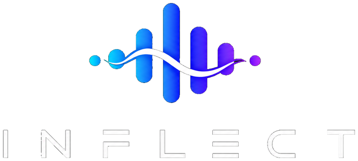
</picture>

# INFLECT

### Speech Emotion Intelligence

**Hear beyond words.**

A privacy-first, full-stack **Speech Emotion Recognition** platform for recording or uploading speech, running local acoustic emotion inference, and turning voice into an interpretable emotional profile — without retaining the original recording.

<p>
  
  
  
</p>

<p>
  
  
  
  
  
  
</p>

**[Product Tour](#product-tour) · [Features](#core-capabilities) · [Architecture](#system-architecture) · [ML Engine](#machine-learning-engine) · [Privacy](#privacy--security) · [Setup](#getting-started) · [API](#api-surface)**

</div>

---

<a href="./docs/showcase/inflect-product-showcase.png">
  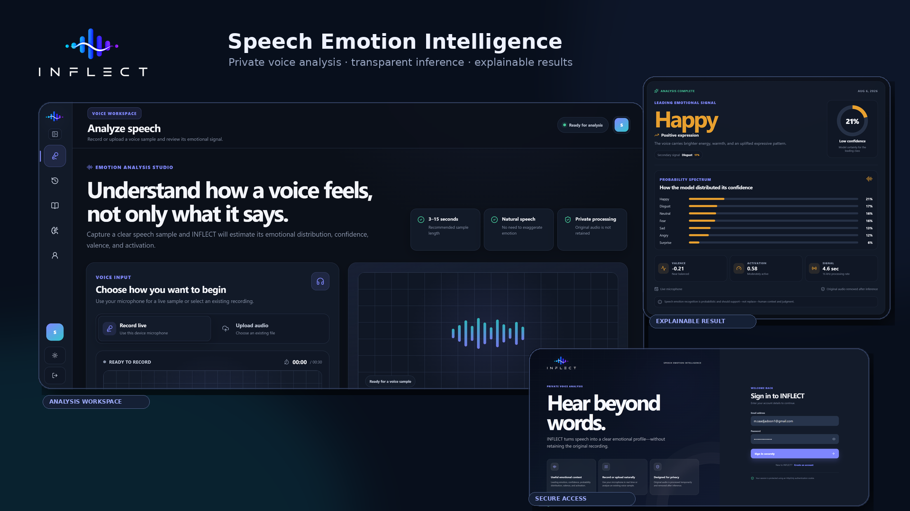
</a>

<p align="center">
  <sub><strong>INFLECT:</strong> secure access, a focused voice-analysis workspace, transparent local inference, and explainable emotional results in one complete product.</sub>
</p>

---

## Table of Contents

- [Overview](#overview)
- [What INFLECT Delivers](#what-inflect-delivers)
- [Why INFLECT Stands Out](#why-inflect-stands-out)
- [Product Tour](#product-tour)
- [Core Capabilities](#core-capabilities)
- [System Architecture](#system-architecture)
- [Machine Learning Engine](#machine-learning-engine)
- [Technology Stack](#technology-stack)
- [Privacy & Security](#privacy--security)
- [Repository Structure](#repository-structure)
- [Getting Started](#getting-started)
- [API Surface](#api-surface)
- [Reproducible Training](#reproducible-training)
- [Validation & Quality](#validation--quality)
- [Deployment](#deployment)
- [Responsible Use](#responsible-use)
- [Documentation](#documentation)

---

## Overview

**INFLECT** is an end-to-end speech-emotion product rather than a standalone model demo. It combines a polished React workspace, a real FastAPI backend, authenticated private history, reproducible RAVDESS training, and an included local inference engine.

The product is built around a simple flow:

> **Capture speech → condition the signal → estimate emotional probabilities → explain the result → retain useful metadata, not the original recording.**

Users can record directly from the browser or upload an existing audio sample, inspect the full seven-class probability spectrum, review confidence, valence and activation, and revisit previous analyses through an authenticated result archive.

### Supported emotional classes

`Angry` · `Disgust` · `Fear` · `Happy` · `Neutral` · `Sad` · `Surprise`

---

## What INFLECT Delivers

| Output | What it means |
|---|---|
| **Leading emotional signal** | Highest-probability class produced by the model |
| **Confidence** | Model probability assigned to the leading class |
| **Probability spectrum** | Complete distribution across all seven emotion classes |
| **Valence** | Weighted negative ↔ positive affect estimate |
| **Activation** | Weighted calm ↔ activated vocal-energy estimate |
| **Signal metadata** | Sample duration, normalized signal rate, source, timestamp and model version |
| **Private history** | Authenticated analysis metadata without retaining original audio |

### Project at a glance

| Area | Implementation |
|---|---|
| **Frontend** | React + TypeScript + Vite |
| **Backend** | FastAPI + Pydantic + SQLAlchemy + Alembic |
| **Inference** | Portable local acoustic ensemble |
| **Audio** | Librosa, SoundFile, SciPy, TorchAudio |
| **Authentication** | HttpOnly cookie + database-backed server sessions |
| **Persistence** | SQLite locally; PostgreSQL-ready configuration |
| **Training data** | RAVDESS speech-only, 1,440 unique clips |
| **Evaluation** | Speaker-disjoint validation and held-out test actors |
| **Themes** | Dedicated dark and light visual systems |
| **Raw audio policy** | Temporary processing only; removed after inference |

---

## Why INFLECT Stands Out

<table>
  <tr>
    <td width="25%" valign="top"><strong>🎙 Product, not a demo</strong><br><sub>Secure access, recording, upload, inference, history, guidance, settings, themes and account controls form one coherent workflow.</sub></td>
    <td width="25%" valign="top"><strong>🧠 Transparent inference</strong><br><sub>The UI exposes the full class distribution, model confidence, valence, activation and model-design information.</sub></td>
    <td width="25%" valign="top"><strong>🔐 Privacy-aware</strong><br><sub>Original voice input is transient while result metadata remains available through the authenticated backend workspace.</sub></td>
    <td width="25%" valign="top"><strong>📊 Reproducible ML</strong><br><sub>Speaker splits, augmentation manifests, model artifacts, metrics, checksums and training scripts are included in the repository.</sub></td>
  </tr>
</table>

---

<a id="product-tour"></a>
## Product Tour

The screenshots below follow the actual user journey rather than presenting unrelated screens. Every preview is clickable and opens the original full-resolution image on GitHub.

### 1. Secure entry into the workspace

<a href="./docs/screenshots/authentication-dark.png">
  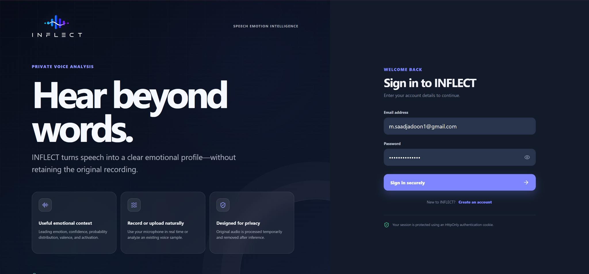
</a>

<p align="center"><sub><strong>Secure Authentication:</strong> a dedicated sign-in experience with a clear product proposition, protected-session messaging and direct access to account creation.</sub></p>

---

### 2. The analysis workspace — light and dark

<table>
  <tr>
    <td width="50%" valign="top">
      <a href="./docs/screenshots/analyze-light.png">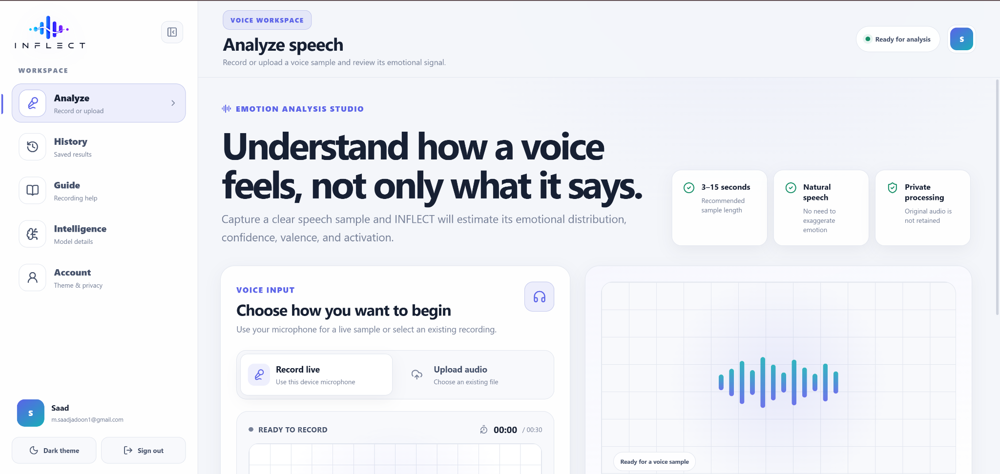</a>
      <br><sub><strong>Light Workspace</strong> — full navigation, voice-input controls, recording guidance and signal visualization.</sub>
    </td>
    <td width="50%" valign="top">
      <a href="./docs/screenshots/analyze-dark.png">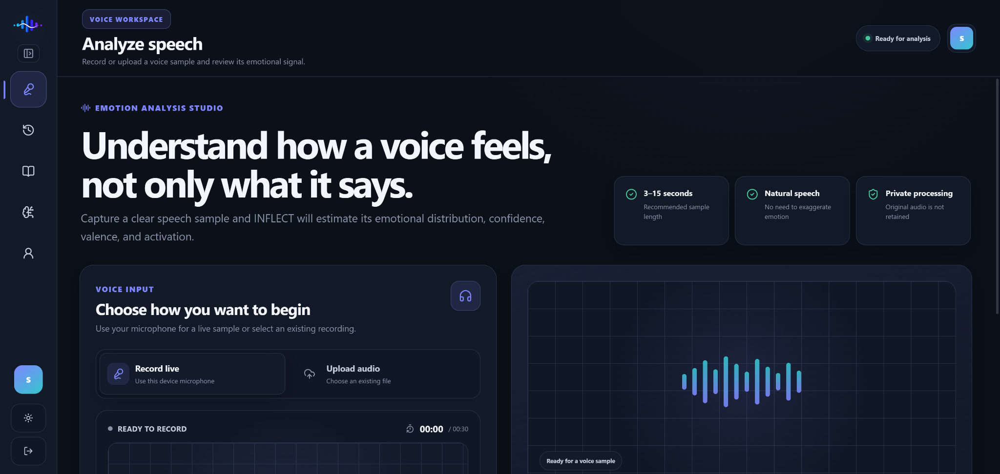</a>
      <br><sub><strong>Dark Focus Mode</strong> — compact navigation maximizes analysis space while preserving the same workflow.</sub>
    </td>
  </tr>
</table>

---

### 3. Voice capture → inference → explainable result

The core interaction is intentionally staged: capture first, review the sample, show explicit processing feedback, then reveal a structured result instead of dropping the user into an unexplained prediction.

<table>
  <tr>
    <td width="33%" valign="top">
      <a href="./docs/screenshots/recording-captured.png">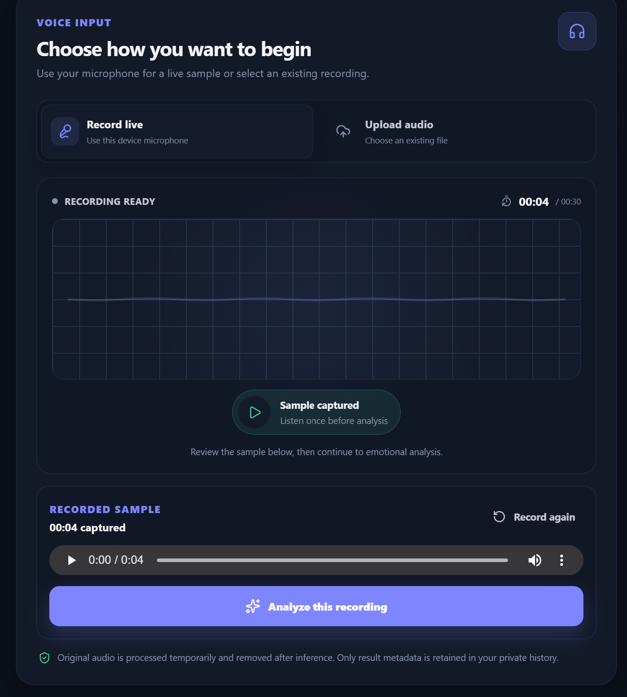</a>
      <br><sub><strong>01 · Sample captured</strong><br>Playback review, elapsed duration, re-record and analysis controls.</sub>
    </td>
    <td width="33%" valign="top">
      <a href="./docs/screenshots/analysis-progress.png">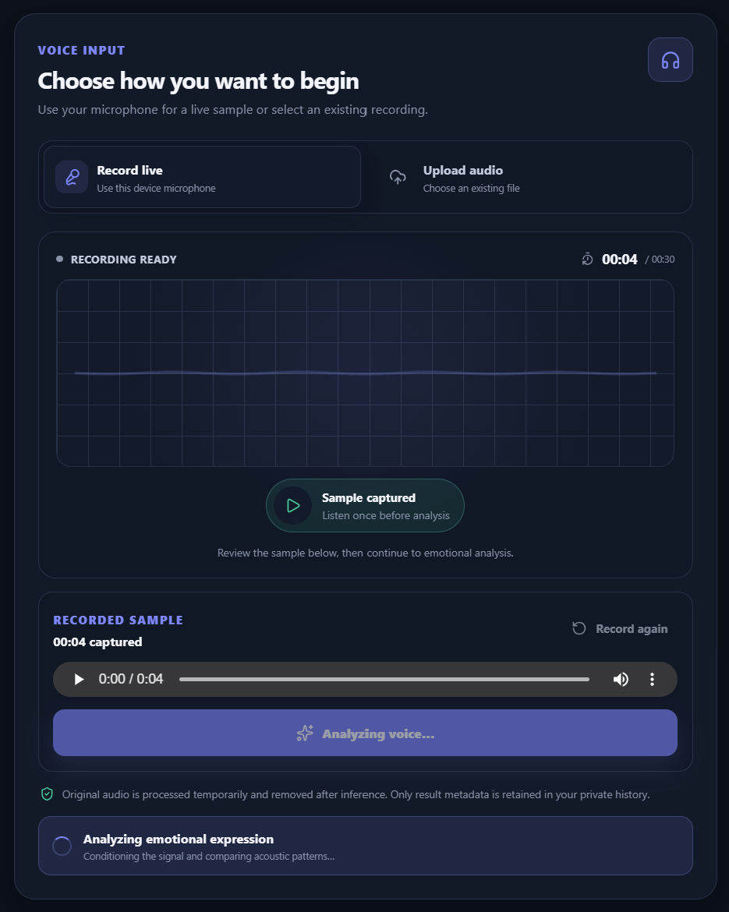</a>
      <br><sub><strong>02 · Analysis in progress</strong><br>Clear disabled state and processing feedback while acoustic patterns are evaluated.</sub>
    </td>
    <td width="34%" valign="top">
      <a href="./docs/screenshots/analysis-result.png">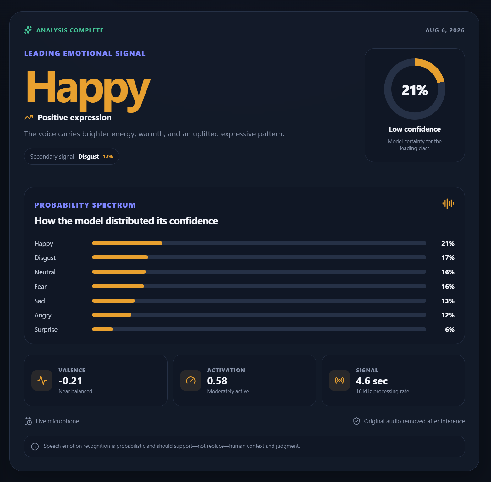</a>
      <br><sub><strong>03 · Result explained</strong><br>Leading signal, confidence, probability spectrum, valence, activation and signal metadata.</sub>
    </td>
  </tr>
</table>

---

### 4. Private history built around result metadata

<a href="./docs/screenshots/history-dark.png">
  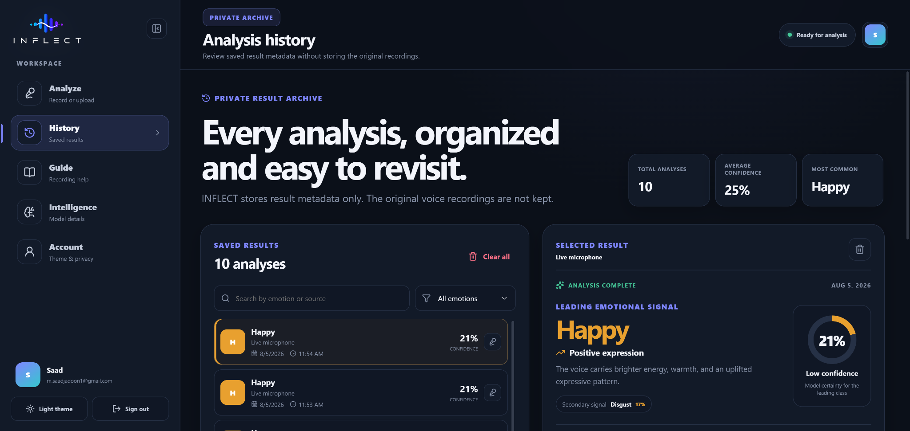
</a>

<p align="center"><sub><strong>Private Result Archive:</strong> searchable and filterable analyses, summary statistics, selected-result inspection and deletion controls — without keeping the original recording.</sub></p>

---

### 5. Model transparency and recording guidance

<table>
  <tr>
    <td width="50%" valign="top">
      <a href="./docs/screenshots/intelligence-dark.png">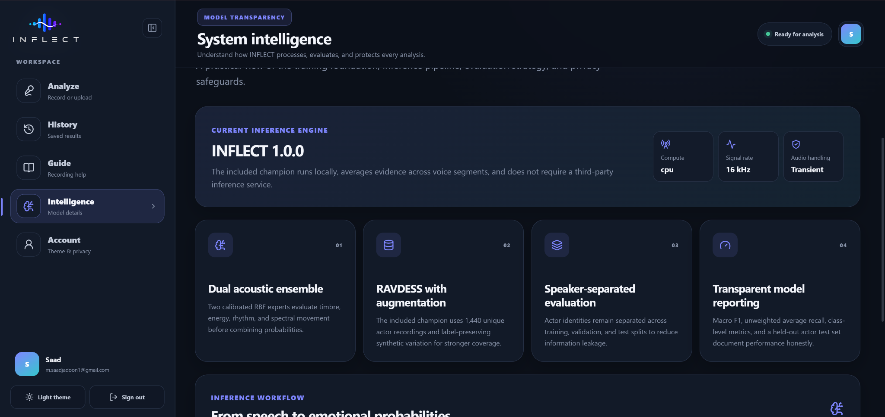</a>
      <br><sub><strong>System Intelligence</strong> — model version, signal rate, transient audio handling, ensemble design, dataset strategy and evaluation philosophy.</sub>
    </td>
    <td width="50%" valign="top">
      <a href="./docs/screenshots/recording-guide-dark.png">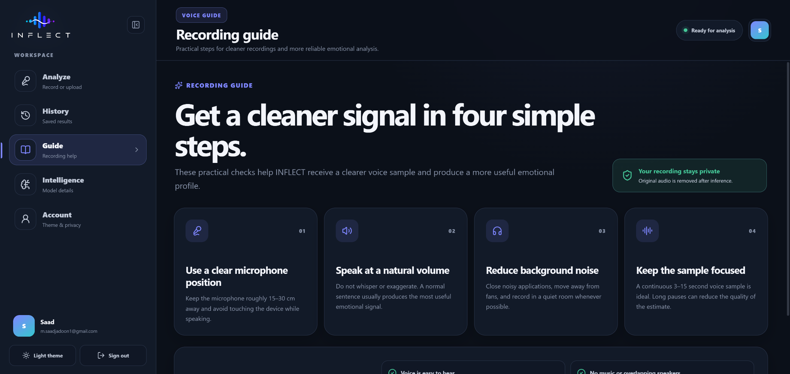</a>
      <br><sub><strong>Recording Guide</strong> — microphone position, natural speaking volume, noise control and focused sample-length guidance.</sub>
    </td>
  </tr>
</table>

---

### 6. Account, appearance and privacy controls

<a href="./docs/screenshots/account-light.png">
  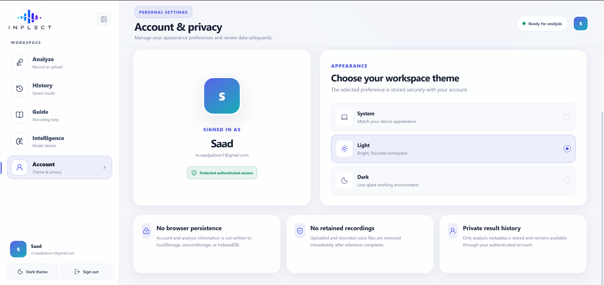
</a>

<p align="center"><sub><strong>Account & Privacy:</strong> authenticated identity, workspace theme selection and explicit data-handling safeguards presented in one settings surface.</sub></p>

<p align="right"><a href="#top">Back to top ↑</a></p>

---

<a id="core-capabilities"></a>
## Core Capabilities

### 🎙 Voice input and signal handling

- Record directly through the browser microphone.
- Review the captured sample before analysis.
- Re-record without leaving the analysis flow.
- Upload existing **WAV, MP3, M4A, WebM, OGG and FLAC** audio.
- Enforce backend duration and size guardrails.
- Convert audio to mono, resample to **16 kHz**, and normalize amplitude.
- Process uploaded data through temporary files rather than preserving raw recordings.

### 🧠 Emotion intelligence

- Seven-class probability distribution.
- Leading emotional signal and associated confidence.
- Derived valence and activation scores.
- Multi-window analysis for longer speech samples.
- Included offline inference artifacts under `models/champion/`.
- Portable NumPy model artifacts rather than runtime dependence on pickled scikit-learn objects.

### 🗂 Private result archive

- User-scoped server-side history.
- Search by emotion or source.
- Emotion filtering.
- Selected-result inspection.
- Per-result deletion and clear-all actions.
- Aggregate statistics such as total analyses, average confidence and most common leading emotion.
- Original audio excluded from stored history.

### 👤 Account and personalization

- Registration, login and logout.
- Authenticated user lookup.
- Argon2-backed password hashing through `pwdlib`.
- Random server-session tokens with only their SHA-256 digest stored in the database.
- System, light and dark theme preferences.
- Backend-managed profile data and avatar handling.

### ✨ Product experience

- Responsive React + TypeScript application.
- Full light and dark theme systems.
- Collapsible workspace navigation.
- Dedicated Analyze, History, Guide, Intelligence and Account experiences.
- Purpose-built empty, recording, processing, error and completed-analysis states.
- Custom waveform and signal visualizations.
- Clear privacy language at the point where users make decisions.

---

<a id="system-architecture"></a>
## System Architecture

```mermaid
flowchart LR
    U[User] --> UI[React + TypeScript Client]
    UI -->|HttpOnly session cookie| API[FastAPI Application]

    UI -->|Recorded WAV / Audio Upload| V[POST /api/analysis/voice]
    V --> T[Temporary Audio File]
    T --> A[Decode + Validate + Mono]
    A --> R[Resample 16 kHz + Normalize]
    R --> F[Acoustic Feature Extraction]

    F --> E1[Portable RBF-SVM Expert A]
    F --> E2[Portable RBF-SVM Expert B]
    E1 --> X[Weighted Probability Fusion]
    E2 --> X
    X --> C[Temperature Calibration]
    C --> P[7-Class Probability Distribution]
    P --> VA[Valence + Activation]

    VA --> RESP[Analysis Response]
    RESP --> DB[(User-scoped metadata DB)]
    T -. removed after inference .-> DEL[Raw audio deleted]
```

### Analysis lifecycle

1. The browser records speech or submits an existing audio file.
2. FastAPI receives the sample and writes it to a temporary processing file.
3. The audio pipeline decodes, validates, converts to mono, resamples to **16 kHz**, and normalizes the waveform.
4. The local champion extracts acoustic features from analysis windows.
5. Two calibrated RBF-SVM experts estimate class probabilities.
6. Their outputs are fused and temperature-calibrated.
7. INFLECT derives the leading class, confidence, valence and activation.
8. Result metadata is returned to the UI and saved to the authenticated user's history.
9. The original temporary audio is removed after inference, including failure paths.

### Authentication and persistence flow

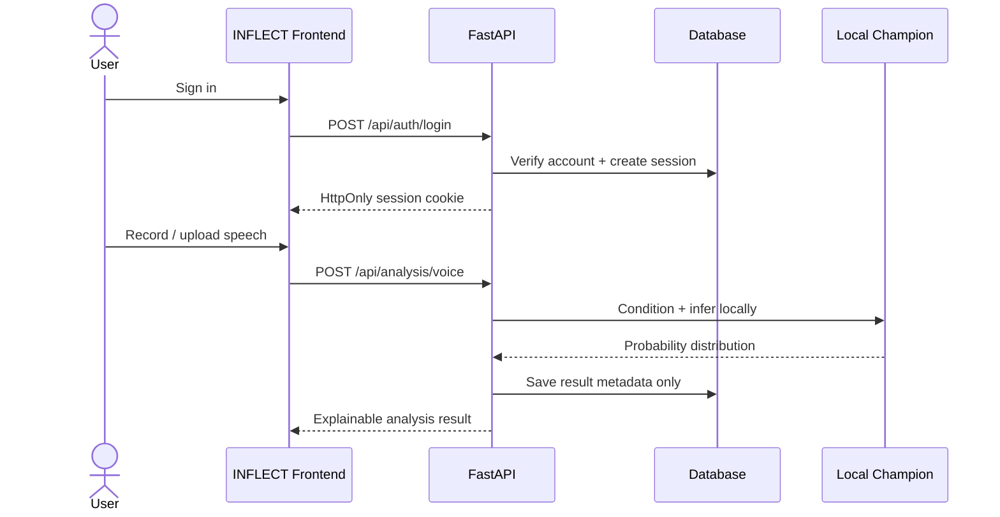

---

<a id="machine-learning-engine"></a>
## Machine Learning Engine

The included production model is **INFLECT RAVDESS Synthetic Acoustic Ensemble v1.0.0**.

### Dataset and split design

| Property | Value |
|---|---:|
| Dataset | RAVDESS speech-only |
| Unique speech clips | **1,440** |
| Actors | **24** |
| Train actors | **01–16** |
| Validation actors | **17–20** |
| Test actors | **21–24** |
| Original training clips | **960** |
| Synthetic views per training clip | **3** |
| Effective training examples | **3,840** |
| Split strategy | **Speaker-disjoint** |
| Output taxonomy | 7 classes; RAVDESS `calm` mapped to `neutral` |

The actor split and synthetic augmentation records are committed under `data/manifests/` to make the training protocol inspectable and reproducible.

### Acoustic representation

Each four-second analysis window is transformed into a **1,606-dimensional** feature vector using a combination of:

- log-Mel distribution statistics;
- first- and second-order spectral-delta statistics;
- multi-resolution temporal pooling;
- RMS energy;
- zero-crossing rate;
- peak amplitude and crest factor;
- waveform mean and standard deviation.

### Champion ensemble

| Expert | Projection | RBF-SVM `C` | Fusion weight |
|---|---:|---:|---:|
| **SVC A** | 256-component PCA | 2.0 | **0.80** |
| **SVC B** | 384-component PCA | 5.0 | **0.20** |

Final probabilities use a validation-selected **temperature of 1.68**.

### Synthetic augmentation

Training diversity is increased using three label-preserving synthetic variants built from controlled combinations of:

- gain variation and time shifting;
- randomized-SNR colored noise;
- multi-tap room echo;
- spectral smoothing / pre-emphasis;
- same-emotion voice blending;
- short temporal dropout.

### Held-out evaluation

> **Speakers are disjoint across train, validation and test.** Actors used for final testing do not appear in model fitting or validation.

| Split | Accuracy | Macro F1 | UAR |
|---|---:|---:|---:|
| Validation — actors 17–20 | **50.00%** | **46.59%** | **48.66%** |
| Final test — actors 21–24 | **43.75%** | **41.87%** | **42.56%** |

<div align="center">
  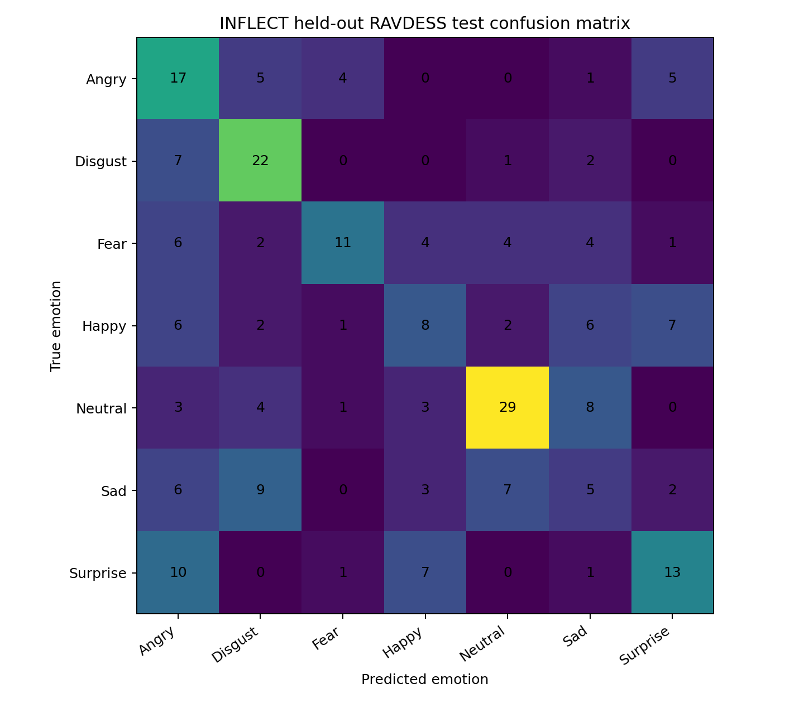
  <br>
  <sub>Held-out RAVDESS test confusion matrix for actors 21–24.</sub>
</div>

Detailed artifacts are available in:

- [`models/champion/MODEL_CARD.md`](models/champion/MODEL_CARD.md)
- [`models/champion/metrics.json`](models/champion/metrics.json)
- [`models/champion/model_config.json`](models/champion/model_config.json)
- [`docs/TRAINING_REPORT.md`](docs/TRAINING_REPORT.md)

---

## Technology Stack

<table>
  <tr>
    <th>Layer</th>
    <th>Technologies</th>
  </tr>
  <tr>
    <td><strong>Frontend</strong></td>
    <td>React · TypeScript · Vite · Lucide React · MediaDevices · Web Audio APIs</td>
  </tr>
  <tr>
    <td><strong>Backend</strong></td>
    <td>FastAPI · Pydantic · SQLAlchemy 2 · Alembic · Uvicorn</td>
  </tr>
  <tr>
    <td><strong>Audio</strong></td>
    <td>Librosa · SoundFile · SciPy · TorchAudio</td>
  </tr>
  <tr>
    <td><strong>ML runtime</strong></td>
    <td>PyTorch · TorchAudio · NumPy · portable RBF-SVM inference</td>
  </tr>
  <tr>
    <td><strong>Training</strong></td>
    <td>scikit-learn · PyTorch · TorchAudio · Matplotlib</td>
  </tr>
  <tr>
    <td><strong>Auth</strong></td>
    <td>HttpOnly cookie · database-backed sessions · Argon2 password hashing</td>
  </tr>
  <tr>
    <td><strong>Database</strong></td>
    <td>SQLite for local development · PostgreSQL-ready production configuration</td>
  </tr>
  <tr>
    <td><strong>Deployment</strong></td>
    <td>Docker · Nginx · Docker Compose · PostgreSQL</td>
  </tr>
</table>

---

<a id="privacy--security"></a>
## Privacy & Security

INFLECT separates **temporary source media** from **persistent result data**.

### Data handling model

| Data | Persisted? | Location / policy |
|---|---|---|
| Raw recorded or uploaded audio | **No** | Temporary processing file only |
| Emotion result metadata | **Yes** | Authenticated backend database |
| Account + password hash | **Yes** | Backend database |
| Raw session token | **No** | Cookie holds token; server stores only its SHA-256 digest |
| Theme preference | **Yes** | Backend account data |
| Profile image | **Yes** | Backend database BLOB |
| Personal app data in `localStorage` / `sessionStorage` / IndexedDB | **No** | Not used for account/history persistence |

### Implemented controls

- HttpOnly authentication cookie.
- `SameSite=Lax` cookie policy.
- Optional secure-cookie mode for HTTPS deployments.
- Argon2-backed password hashing through `pwdlib`.
- Database-backed session expiration and logout revocation.
- Trusted-host middleware.
- Configured-origin CORS restrictions.
- Origin checks on state-changing requests.
- `Cache-Control: no-store` for private/API responses.
- MIME/type and size validation for audio and avatars.
- Per-user authorization for analysis history.
- Original audio cleanup after inference.

For implementation details, see [`SECURITY.md`](SECURITY.md) and [`docs/STORAGE_POLICY.md`](docs/STORAGE_POLICY.md).

---

## Repository Structure

```text
INFLECT/
├── frontend/
│   ├── public/brand/              # INFLECT brand assets
│   └── src/
│       ├── components/            # Recorder, ResultView, Waveform, avatar, brand
│       ├── pages/                 # Analyze, History, Guide, Intelligence, Account, Auth
│       ├── api.ts                 # Typed backend API client
│       └── styles.css             # Responsive light/dark design system
│
├── backend/
│   ├── app/
│   │   ├── api/                   # Authentication, profile, analysis, health routes
│   │   ├── ml/                    # Portable champion runtime + labels
│   │   ├── services/              # Audio and inference orchestration
│   │   ├── models.py              # SQLAlchemy entities
│   │   ├── schemas.py             # Pydantic contracts
│   │   └── security.py            # Password and session security
│   ├── alembic/                   # Database migrations
│   └── tests/                     # Backend tests
│
├── ml/
│   ├── scripts/                   # Training, evaluation and export scripts
│   ├── src/inflect_ml/            # Dataset, labels, split and metric utilities
│   └── configs/                   # Training configuration
│
├── models/champion/               # Portable trained model, metrics and model card
├── data/manifests/                # Speaker split + augmentation manifests
├── docs/                          # Architecture, training, privacy and setup docs
├── scripts/                       # Development and repository helper scripts
├── docker-compose.prod.yml
├── .env.example
└── README.md
```

---

<a id="getting-started"></a>
## Getting Started

### Prerequisites

- Windows 10/11 recommended for the provided PowerShell workflow
- Python **3.14.x**
- Node.js **24+**
- npm
- FFmpeg for compressed audio decoding
- Git

> Docker is optional for local development. SQLite is the default local database.

### 1. Clone

```bash
git clone https://github.com/YOUR_USERNAME/inflect.git
cd inflect
```

### 2. Create local configuration

```powershell
Copy-Item .env.example .env
```

For production use, replace `SECRET_KEY` with a strong random secret and enable secure cookies behind HTTPS.

### 3. Create the Python environment

```powershell
py -3.14 -m venv backend\.venv
Set-ExecutionPolicy -Scope Process -ExecutionPolicy Bypass
& ".\backend\.venv\Scripts\Activate.ps1"

python -m pip install --upgrade pip setuptools wheel
python -m pip install -r backend\requirements.txt
```

### 4. Apply database migrations

```powershell
cd backend
python -m alembic upgrade head
cd ..
```

### 5. Install frontend dependencies

```powershell
cd frontend
npm install
cd ..
```

### 6. Start INFLECT

```powershell
powershell -ExecutionPolicy Bypass -File scripts\dev.ps1
```

| Service | Address |
|---|---|
| Frontend | `http://localhost:5173` |
| FastAPI | `http://127.0.0.1:8000` |
| Swagger / OpenAPI | `http://127.0.0.1:8000/docs` |

The trained champion is already present under `models/champion/`, so normal local inference does not require downloading a remote model.

---

<a id="api-surface"></a>
## API Surface

### Authentication

| Method | Endpoint | Purpose |
|---|---|---|
| `POST` | `/api/auth/register` | Create an account and authenticated session |
| `POST` | `/api/auth/login` | Sign in and create a session |
| `POST` | `/api/auth/logout` | Revoke the current session |
| `GET` | `/api/auth/me` | Read the authenticated user |

### Analysis

| Method | Endpoint | Purpose |
|---|---|---|
| `POST` | `/api/analysis/voice` | Analyze recorded or uploaded speech |
| `GET` | `/api/analysis/model-status` | Read inference-engine status |
| `GET` | `/api/analysis/history` | Read paginated private history |
| `DELETE` | `/api/analysis/history/{id}` | Delete one result |
| `DELETE` | `/api/analysis/history` | Clear the current user's result history |

### Profile

| Method | Endpoint | Purpose |
|---|---|---|
| `PATCH` | `/api/profile` | Update account profile data |
| `PATCH` | `/api/profile/theme` | Save system/light/dark preference |
| `PUT` | `/api/profile/avatar` | Upload profile image |
| `GET` | `/api/profile/avatar` | Fetch profile image |
| `DELETE` | `/api/profile/avatar` | Remove profile image |

### Health

| Method | Endpoint | Purpose |
|---|---|---|
| `GET` | `/api/health` | Basic service-health response |

---

## Reproducible Training

The raw RAVDESS dataset is intentionally not committed to Git.

### Install training dependencies

```powershell
& ".\backend\.venv\Scripts\Activate.ps1"
python -m pip install -r ml\requirements-train.txt
```

### Train from a RAVDESS ZIP archive

```powershell
python .\ml\scripts\train_ravdess_champion.py `
  --archive ".\data\raw\ravdess.zip" `
  --output ".\models\champion" `
  --manifest-dir ".\data\manifests"
```

### Or train from an extracted dataset

```powershell
python .\ml\scripts\train_ravdess_champion.py `
  --ravdess-root ".\data\raw\ravdess" `
  --output ".\models\champion" `
  --manifest-dir ".\data\manifests"
```

The training pipeline verifies the expected 1,440 clips, creates deterministic actor-disjoint splits, generates synthetic training views, extracts acoustic features, fits and calibrates the ensemble, evaluates on untouched test actors, and exports portable runtime artifacts plus metrics and checksums.

---

## Validation & Quality

### Backend tests

```powershell
& ".\backend\.venv\Scripts\Activate.ps1"
cd backend
pytest -q
```

### Frontend production build

```powershell
cd frontend
npm run build
```

### Repository preflight

```powershell
powershell -ExecutionPolicy Bypass -File scripts\preflight_repo.ps1
```

The repository also contains `REPOSITORY_VALIDATION.json` for automated checks covering source compilation, model artifacts, checksums, oversized files, accidental secrets and browser-persistence usage.

---

## Deployment

A production-style Compose definition is included in `docker-compose.prod.yml` with:

- PostgreSQL 16;
- FastAPI backend image;
- read-only mounted model directory;
- Nginx-served frontend image.

```bash
docker compose -f docker-compose.prod.yml up --build
```

For public deployment, configure a strong database password, a long `SECRET_KEY`, the correct frontend origin, HTTPS, `COOKIE_SECURE=true`, and trusted hosts.

---

## Responsible Use

Speech Emotion Recognition is **probabilistic acoustic pattern recognition**. INFLECT estimates patterns present in vocal expression; it does not determine a person's true internal state, thoughts, honesty or intent.

The included model was trained on **acted English speech recorded under controlled RAVDESS conditions**. Real microphones, accents, languages, noise conditions, speaking styles and emotional expression may differ substantially from the training domain.

INFLECT should not be used as a medical or psychological diagnostic system, lie detector, truthfulness detector, intent detector, hiring gate, law-enforcement decision system, or substitute for human judgment and context.

---

## Documentation

| Document | Purpose |
|---|---|
| [`docs/TRAINING_REPORT.md`](docs/TRAINING_REPORT.md) | Dataset verification, augmentation, model design and held-out metrics |
| [`models/champion/MODEL_CARD.md`](models/champion/MODEL_CARD.md) | Champion model card and responsible-use details |
| [`docs/STORAGE_POLICY.md`](docs/STORAGE_POLICY.md) | Backend and browser storage policy |
| [`SECURITY.md`](SECURITY.md) | Security design and reporting guidance |
| [`docs/AUGMENTATION_POLICY.md`](docs/AUGMENTATION_POLICY.md) | Synthetic augmentation policy |
| [`docs/ARCHITECTURE.md`](docs/ARCHITECTURE.md) | System architecture details |
| [`COMMANDS.md`](COMMANDS.md) | Windows setup, run, training and repair commands |
| [`CONTRIBUTING.md`](CONTRIBUTING.md) | Contribution workflow |

---

<div align="center">

<picture>
  <source media="(prefers-color-scheme: dark)" srcset="./docs/brand/inflect-dark.png">
  <source media="(prefers-color-scheme: light)" srcset="./docs/brand/inflect-light.png">
  
</picture>

### INFLECT

**Private speech emotion intelligence — engineered from signal to interface.**

<sub>React · TypeScript · FastAPI · PyTorch · TorchAudio · RAVDESS · SQLAlchemy · Alembic</sub>

<br><br>

<a href="#top"><strong>Back to top ↑</strong></a>

</div>
