<a id="top"></a>

<div align="center">

<picture>
  <source media="(prefers-color-scheme: dark)" srcset="./frontend/public/brand/writelens-dark.png">
  <source media="(prefers-color-scheme: light)" srcset="./frontend/public/brand/writelens-light.png">
  
</picture>

# WriteLens

### See What You Write

**A privacy-first, full-stack handwritten character recognition workspace powered by custom PyTorch CNNs, MNIST, EMNIST ByClass, FastAPI, React and TypeScript.**

WriteLens turns a handwritten mark into an explainable character prediction through a complete machine-learning product flow: secure accounts, image upload, an interactive drawing canvas, deterministic preprocessing, TorchScript inference, ranked candidate probabilities, model transparency, private recognition history, profile management, and responsive light/dark interfaces.

<p>
  <a href="#getting-started"></a>
  <a href="#product-tour"></a>
  <a href="#machine-learning-system"></a>
</p>

<p>
  
  
  
  
  
  
  
  
  
</p>

**Upload · Draw · Normalize · Recognize · Explain · Review**

[Overview](#overview) · [Product Tour](#product-tour) · [ML System](#machine-learning-system) · [Architecture](#architecture) · [API](#rest-api-reference) · [Installation](#getting-started)

</div>

---

<a href="./docs/screenshots/01-recognition-studio-dark.png">
  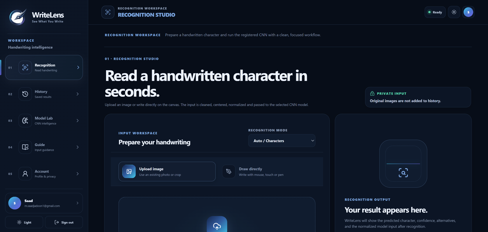
</a>

<p align="center"><sub><strong>WriteLens Recognition Studio:</strong> a focused handwriting workspace with upload and drawing inputs, model selection, private processing, and a dedicated prediction panel.</sub></p>

---

## Table of Contents

- [Overview](#overview)
- [Project Vision](#project-vision)
- [Why WriteLens Stands Out](#why-writelens-stands-out)
- [Product Tour](#product-tour)
- [Core Product Features](#core-product-features)
- [Machine Learning System](#machine-learning-system)
- [Model Evaluation](#model-evaluation)
- [Image Preprocessing Pipeline](#image-preprocessing-pipeline)
- [Architecture](#architecture)
- [Privacy and Security Architecture](#privacy-and-security-architecture)
- [Technology Stack](#technology-stack)
- [Project Structure](#project-structure)
- [REST API Reference](#rest-api-reference)
- [Database Model](#database-model)
- [Getting Started](#getting-started)
- [Run the Application](#run-the-application)
- [Dataset and Training Commands](#dataset-and-training-commands)
- [Model Registration and Evaluation](#model-registration-and-evaluation)
- [CRNN Word Recognition Extension](#crnn-word-recognition-extension)
- [Testing and Validation](#testing-and-validation)
- [Environment Configuration](#environment-configuration)
- [Production Hardening](#production-hardening)
- [Responsible Use](#responsible-use)
- [Author](#author)
- [Acknowledgements](#acknowledgements)

---

## Overview

**WriteLens** is an end-to-end handwritten character recognition application built as a complete machine-learning product rather than a notebook-only classifier. It combines a custom computer-vision training pipeline with a secure backend and a polished browser workspace.

A user can authenticate, upload a handwriting image or draw directly with a mouse/touch/pen, choose a recognition mode, submit the sample, and receive a ranked prediction from a registered TorchScript model. The response includes the leading class, confidence, top alternatives, the normalized `28 × 28` model input, model version, and source metadata.

The application separates **temporary handwriting input** from **persistent recognition metadata**. Raw uploaded or drawn handwriting is processed for the current request and is not added to the user's history. History retains the useful analytical output—prediction, probabilities, model identity, source type, foreground ratio, and timestamp—without retaining the original handwriting image.

> WriteLens demonstrates product design, frontend engineering, backend architecture, authentication, privacy-aware data handling, computer vision, deep learning, reproducible evaluation, and deployable model inference in one coherent system.

---

## Project Vision

A handwritten-character classifier is easy to demonstrate in a notebook. Building it into a usable product requires much more:

1. Accept inconsistent real-world handwriting inputs.
2. Normalize them into the same representation used during training.
3. Select the correct model for digits or general characters.
4. Run deterministic inference from real trained checkpoints.
5. Return probabilities instead of only a hard label.
6. Make low-confidence predictions visible rather than hiding uncertainty.
7. Protect the original handwriting input.
8. Preserve useful result metadata per authenticated user.
9. Expose real model metrics and checkpoint readiness.
10. Deliver the entire workflow through a responsive, production-style interface.

WriteLens was designed around that complete lifecycle.

---

## Why WriteLens Stands Out

| Area | Implementation |
|---|---|
| **Complete ML product** | Training, evaluation, model registry, inference API, preprocessing, frontend, authentication and result history live in one project. |
| **Two application specialists** | A dedicated MNIST digit model and a 62-class EMNIST ByClass character model are registered for runtime use. |
| **Real evaluation evidence** | Accuracy, Macro F1, UAR, classification reports, learning history and normalized confusion matrices are persisted as model reports. |
| **Input flexibility** | Users can upload PNG/JPEG/WebP images or draw directly on a responsive canvas. |
| **Explainable output** | The UI shows the leading prediction, confidence, top-five candidates, normalized input preview, foreground ratio and model version. |
| **Privacy-aware design** | Raw recognition images are not stored in history; authenticated API responses are marked `no-store`. |
| **Backend-owned account state** | Profile, theme, avatar, password hash, sessions and recognition metadata are handled by the backend/database rather than browser persistence APIs. |
| **Secure sessions** | Authentication uses an HttpOnly SameSite session cookie while the server stores only a SHA-256 hash of the random session token. |
| **Professional UX** | Dedicated Recognition, History, Model Lab, Guide and Account workspaces with dark/light/system themes. |
| **Extensible ML architecture** | A CRNN + BiLSTM + CTC path is included for future word/line recognition datasets. |

---

<a id="product-tour"></a>
## Product Tour

The screenshots below follow the actual WriteLens user journey rather than presenting unrelated screens. Every preview is clickable and opens the original full-resolution image on GitHub.

### 1. Secure entry into the workspace

<a href="./docs/screenshots/11-authentication-landing-dark.png">
  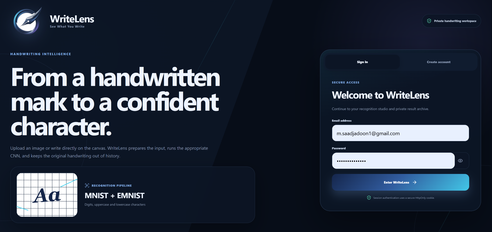
</a>

<p align="center"><sub><strong>Secure Entry:</strong> product positioning, handwriting-recognition pipeline context, protected access and account onboarding in one focused experience.</sub></p>

<table>
  <tr>
    <td width="50%" valign="top">
      <a href="./docs/screenshots/12-sign-in-panel-dark.png">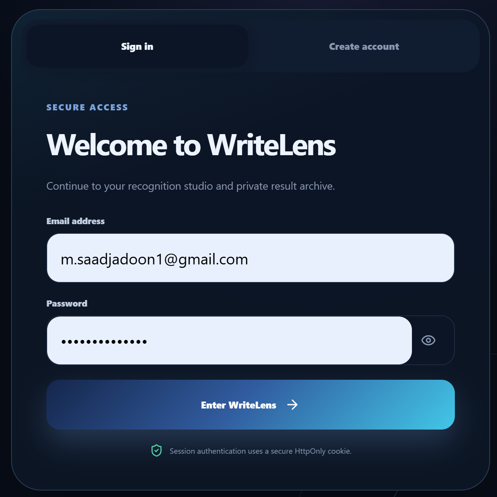</a>
      <br><sub><strong>Sign In</strong> — email/password authentication, password visibility control and secure HttpOnly-session messaging.</sub>
    </td>
    <td width="50%" valign="top">
      <a href="./docs/screenshots/13-create-account-panel-dark.png">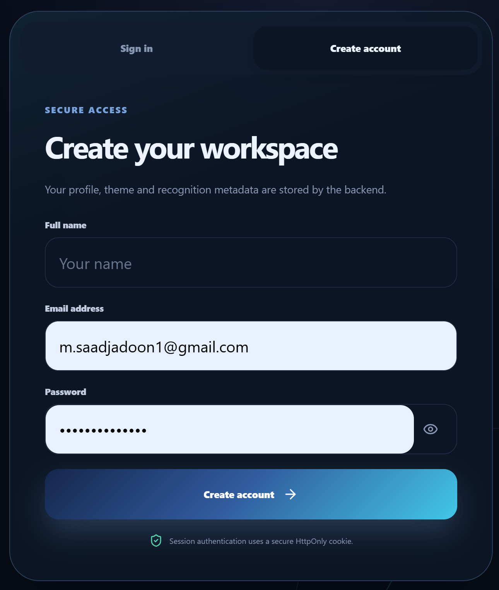</a>
      <br><sub><strong>Create Account</strong> — full-name, email and password onboarding backed by the application database.</sub>
    </td>
  </tr>
</table>

---

### 2. Recognition Studio — dark and light

The primary workspace keeps handwriting preparation and prediction context visible together while preserving the same workflow across dedicated dark and light visual systems.

<table>
  <tr>
    <td width="50%" valign="top">
      <a href="./docs/screenshots/01-recognition-studio-dark.png"></a>
      <br><sub><strong>Dark Recognition Studio</strong> — focused upload/draw workflow, recognition-mode selector, private-input notice and dedicated result panel.</sub>
    </td>
    <td width="50%" valign="top">
      <a href="./docs/screenshots/10-recognition-light.png">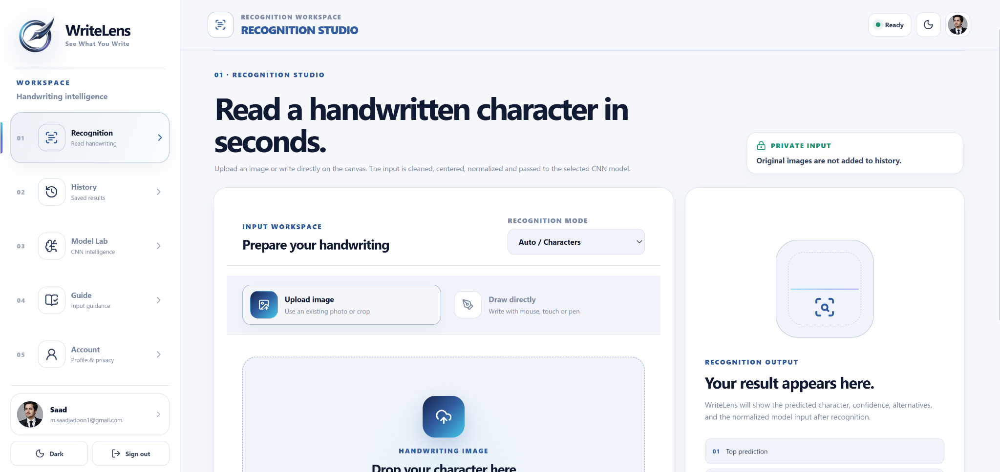</a>
      <br><sub><strong>Light Recognition Studio</strong> — the same hierarchy and inference workflow translated into a purpose-built bright interface.</sub>
    </td>
  </tr>
</table>

---

### 3. Handwriting input → inference → explainable result

The core interaction is intentionally staged: prepare the source, draw or upload one character, submit it for inference, then inspect a structured result with confidence, candidate probabilities and the normalized model input.

<table>
  <tr>
    <td width="33%" valign="top">
      <a href="./docs/screenshots/02-upload-workspace-dark.png">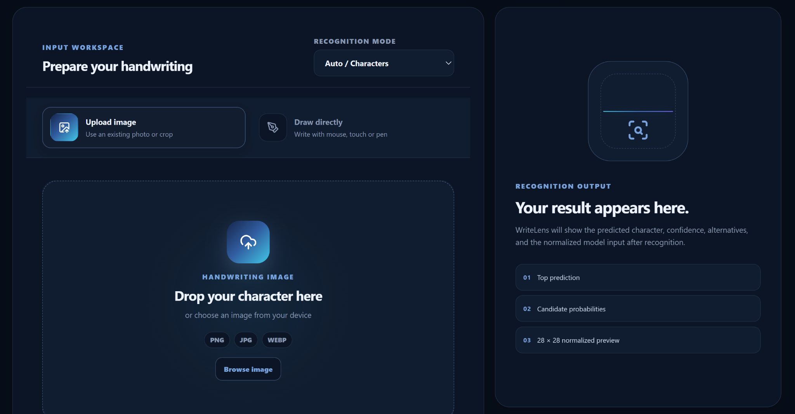</a>
      <br><sub><strong>01 · Upload input</strong><br>Drag-and-drop or browse for PNG, JPEG and WebP handwriting samples.</sub>
    </td>
    <td width="33%" valign="top">
      <a href="./docs/screenshots/04-drawing-character-dark.png">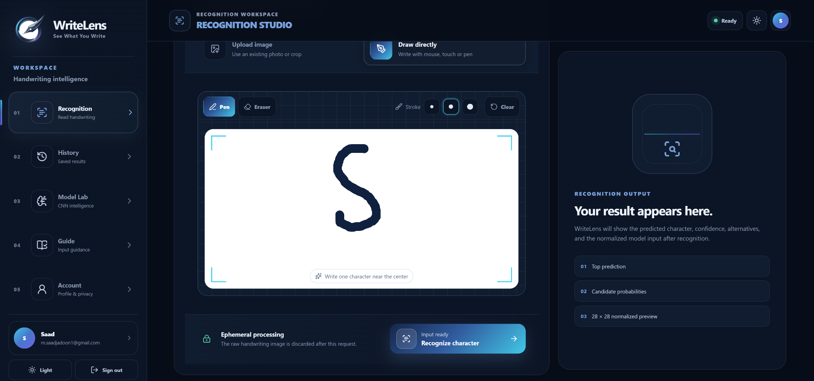</a>
      <br><sub><strong>02 · Character prepared</strong><br>A handwritten mark is captured directly on the responsive canvas before recognition.</sub>
    </td>
    <td width="34%" valign="top">
      <a href="./docs/screenshots/05-recognition-result-character-dark.png">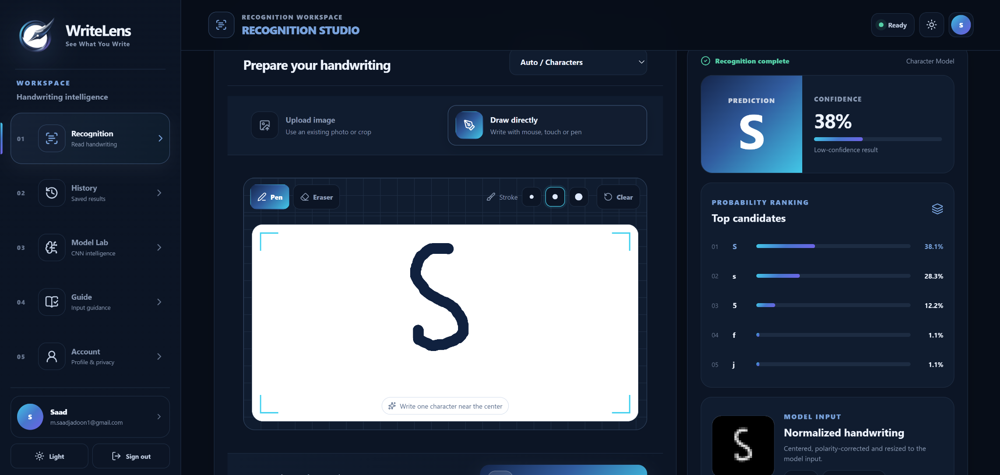</a>
      <br><sub><strong>03 · Result explained</strong><br>Prediction, confidence, ranked alternatives and normalized model input appear together.</sub>
    </td>
  </tr>
</table>

<table>
  <tr>
    <td width="50%" valign="top">
      <a href="./docs/screenshots/03-drawing-canvas-empty-dark.png">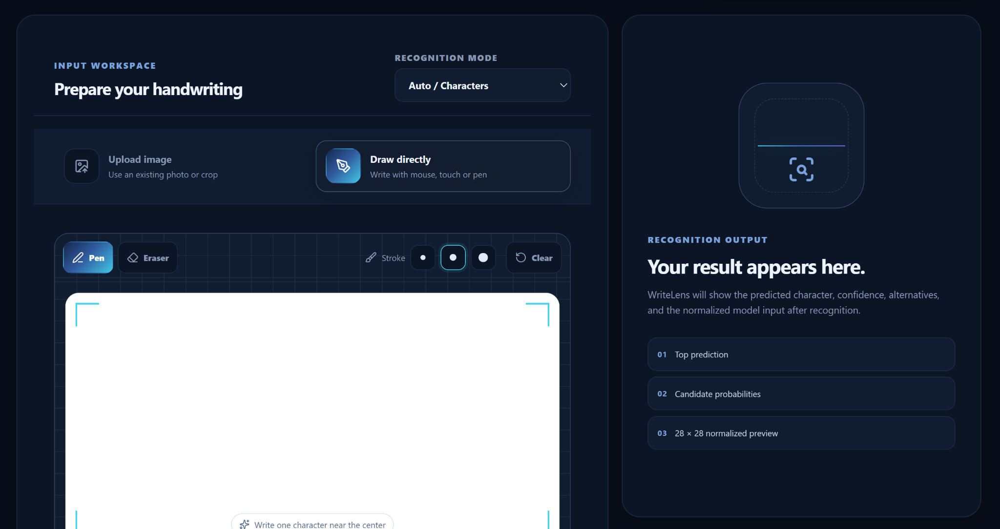</a>
      <br><sub><strong>Direct Drawing Controls</strong> — pen, eraser, stroke widths and clear controls for mouse, touch or pen input.</sub>
    </td>
    <td width="50%" valign="top">
      <a href="./docs/screenshots/06-recognition-result-digit-dark.png">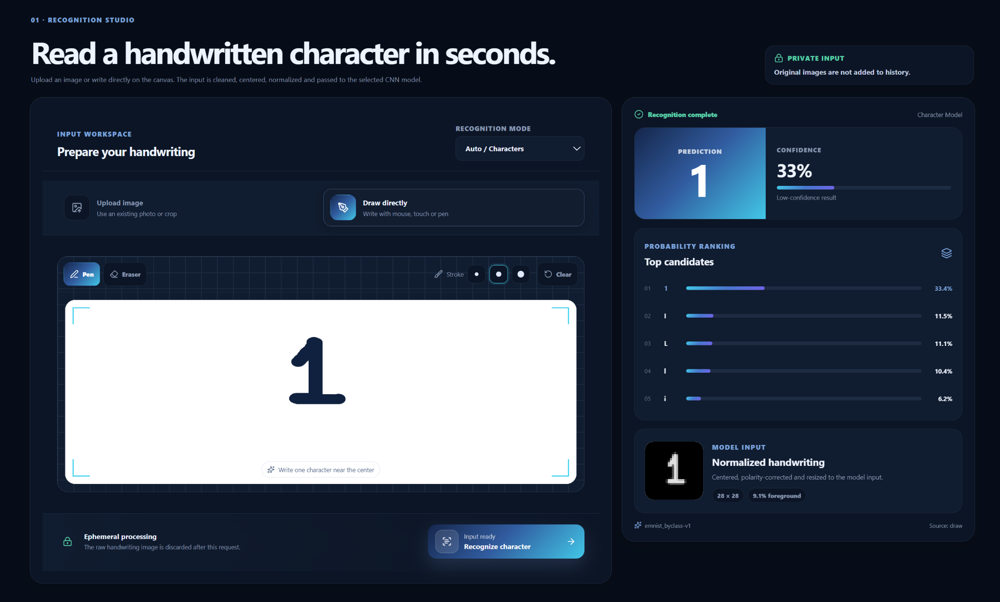</a>
      <br><sub><strong>Digit Inference</strong> — the same explainable prediction path applied to numeric handwriting through the digit specialist.</sub>
    </td>
  </tr>
</table>

---

### 4. Private recognition history

<a href="./docs/screenshots/07-recognition-history-dark.png">
  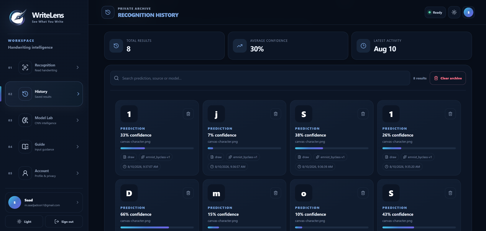
</a>

<p align="center"><sub><strong>Private Result Archive:</strong> searchable recognition metadata, confidence summaries, model/source details, timestamps and deletion controls — without retaining the original handwriting image.</sub></p>

---

### 5. Model transparency and recognition guidance

<table>
  <tr>
    <td width="50%" valign="top">
      <a href="./docs/screenshots/14-model-lab-overview-dark.png">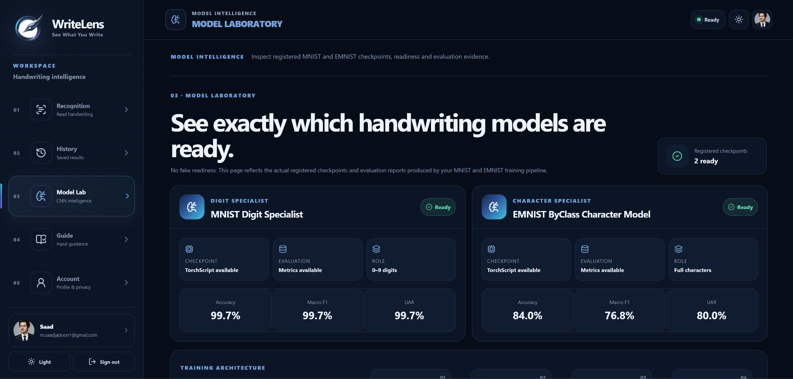</a>
      <br><sub><strong>Model Laboratory</strong> — registered MNIST and EMNIST checkpoints, runtime roles, readiness state and saved evaluation evidence.</sub>
    </td>
    <td width="50%" valign="top">
      <a href="./docs/screenshots/15-model-lab-training-architecture-dark.png">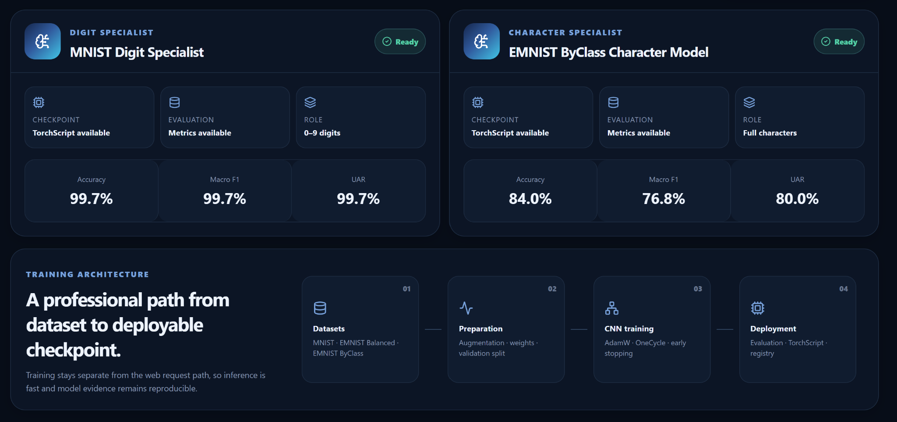</a>
      <br><sub><strong>Training Architecture</strong> — Accuracy, Macro F1, UAR and the path from dataset preparation to deployable TorchScript checkpoints.</sub>
    </td>
  </tr>
</table>

<table>
  <tr>
    <td width="50%" valign="top">
      <a href="./docs/screenshots/17-guide-overview-dark.png">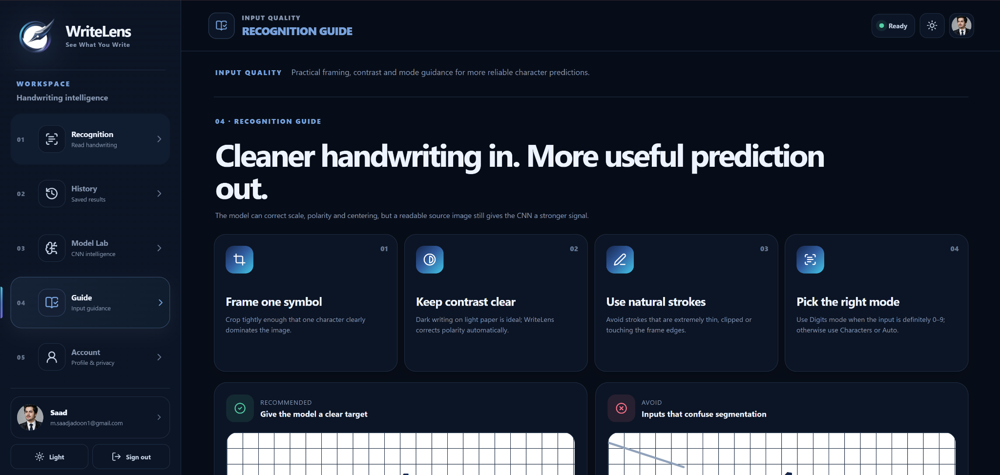</a>
      <br><sub><strong>Recognition Guide</strong> — concise framing, contrast, stroke-quality and recognition-mode guidance.</sub>
    </td>
    <td width="50%" valign="top">
      <a href="./docs/screenshots/16-guide-detail-dark.png">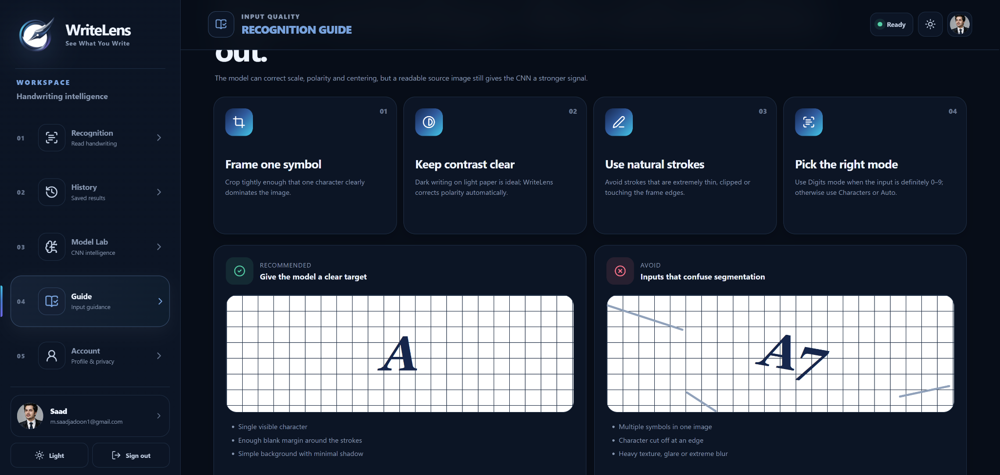</a>
      <br><sub><strong>Recommended vs Avoid</strong> — visual examples showing clean single-character inputs versus ambiguous segmentation cases.</sub>
    </td>
  </tr>
</table>

---

### 6. Account, appearance and security controls

Profile identity, avatar, username, email, password management and theme preferences are grouped into one authenticated account surface and rendered consistently across dark and light themes.

<table>
  <tr>
    <td width="50%" valign="top">
      <a href="./docs/screenshots/08-account-dark.png">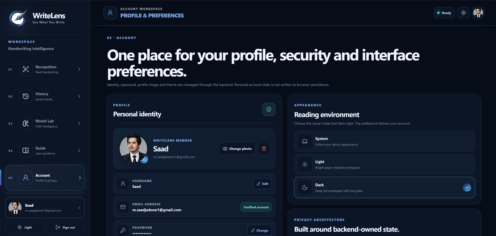</a>
      <br><sub><strong>Dark Account Workspace</strong> — identity, security and appearance controls in the low-glare interface.</sub>
    </td>
    <td width="50%" valign="top">
      <a href="./docs/screenshots/09-account-light.png">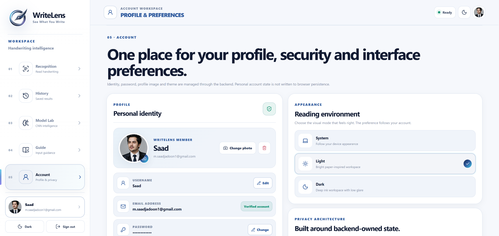</a>
      <br><sub><strong>Light Account Workspace</strong> — the same backend-owned profile and preference controls in the bright theme.</sub>
    </td>
  </tr>
</table>

<p align="right"><a href="#top">Back to top ↑</a></p>

---

## Core Product Features

### Recognition Workspace

- Upload handwriting as **PNG, JPEG or WebP**.
- Drag-and-drop file input with an image preview.
- Draw directly using **mouse, touch or pen** pointer events.
- Pen and eraser tools.
- Three selectable stroke widths.
- One-click canvas clearing.
- Modes for **Auto / Characters**, **Characters**, and **Digits only**.
- Busy/processing state while inference is running.
- Friendly validation and recognition errors.

### Prediction Experience

- Leading predicted class.
- Model confidence percentage.
- Confidence-aware text: strong, moderate or low preference.
- Top-five candidate probability ranking.
- Progress bars for candidate probabilities.
- `28 × 28` normalized model-input preview.
- Foreground-pixel ratio.
- Runtime model role and model version.
- Input source type.

### Recognition History

- User-scoped backend history.
- Total result count.
- Average confidence summary.
- Latest-activity summary.
- Search by prediction, source filename or model version.
- Per-record deletion.
- Clear-all history action with confirmation.
- Raw source image excluded from saved history.

### Profile and Appearance

- Server-backed display name.
- Authenticated email identity.
- Profile photo upload, replacement and deletion.
- Current-password verification before password change.
- Other active sessions invalidated after password change while preserving the current session.
- System, light and dark appearance modes.
- Theme stored with the backend account.
- Sidebar and header avatars synchronized with profile state.

### Model Transparency

- Runtime checkpoint readiness.
- Registered model names and roles.
- Evaluation-report availability.
- Accuracy, Macro F1 and UAR surfaced from saved model metrics.
- Clear split between digit and general-character specialists.

---

## Machine Learning System

### Runtime Model Policy

WriteLens uses a small registry to decide which trained model handles each request:

| Recognition role | Active model | Dataset | Classes | Runtime artifact |
|---|---|---|---:|---|
| **Digit** | MNIST Digit Specialist | MNIST | 10 | TorchScript `.pt` |
| **Character** | EMNIST ByClass Character Model | EMNIST ByClass | 62 | TorchScript `.pt` |

`Digits only` selects the digit specialist. `Characters` and the current `Auto / Characters` path use the EMNIST ByClass specialist.

### WriteLensCNN Architecture

The deployed classifiers are trained from scratch using a compact convolutional architecture designed for `1 × 28 × 28` grayscale inputs.

```text
Input: 1 × 28 × 28
        │
        ▼
ConvBlock 1
Conv 1→32 → BatchNorm → GELU
Conv 32→32 → BatchNorm → GELU
MaxPool → Dropout2D
        │
        ▼
ConvBlock 2
Conv 32→64 → BatchNorm → GELU
Conv 64→64 → BatchNorm → GELU
MaxPool → Dropout2D
        │
        ▼
ConvBlock 3
Conv 64→128 → BatchNorm → GELU
Conv 128→128 → BatchNorm → GELU
MaxPool → Dropout2D
        │
        ▼
AdaptiveAvgPool 2 × 2
        │
        ▼
Flatten → Linear 512→256 → GELU → Dropout 0.35
        │
        ▼
Linear 256→N classes
```

### Training Recipe

The classifier training pipeline includes:

- Deterministic seed control for Python, NumPy and PyTorch.
- EMNIST orientation correction before training/inference evaluation.
- Random affine augmentation: rotation, translation, scale and shear.
- Random perspective augmentation.
- Tensor normalization with mean `0.5`, standard deviation `0.5`.
- Stratified `90/10` train/validation split.
- Inverse-frequency class weighting.
- Cross-entropy loss with `0.05` label smoothing.
- AdamW optimizer.
- OneCycle learning-rate schedule.
- CUDA automatic mixed precision when a GPU is available.
- Gradient clipping at `5.0`.
- Early stopping on validation **Macro F1**.
- Held-out test evaluation.
- Accuracy, Macro F1 and Unweighted Average Recall (UAR).
- Full classification report.
- Normalized confusion matrix.
- TorchScript export for application inference.
- JSON checkpoint metadata for classes, normalization and versioning.

---

## Model Evaluation

The repository includes trained runtime checkpoints and their evaluation reports.

| Model | Test samples | Classes | Accuracy | Macro F1 | UAR | Training epochs completed |
|---|---:|---:|---:|---:|---:|---:|
| **MNIST Digit Specialist** | 10,000 | 10 | **99.74%** | **99.74%** | **99.73%** | 15 |
| **EMNIST ByClass Character Model** | 116,323 | 62 | **83.95%** | **76.82%** | **79.96%** | 27 |

The difference between overall accuracy and Macro F1 on EMNIST ByClass is important: the 62-class task includes class imbalance and visually ambiguous characters, so Macro F1 gives a more balanced view across classes than accuracy alone.

<table>
<tr>
<td width="50%" valign="top">
<a href="./models/reports/mnist_digit.confusion.png">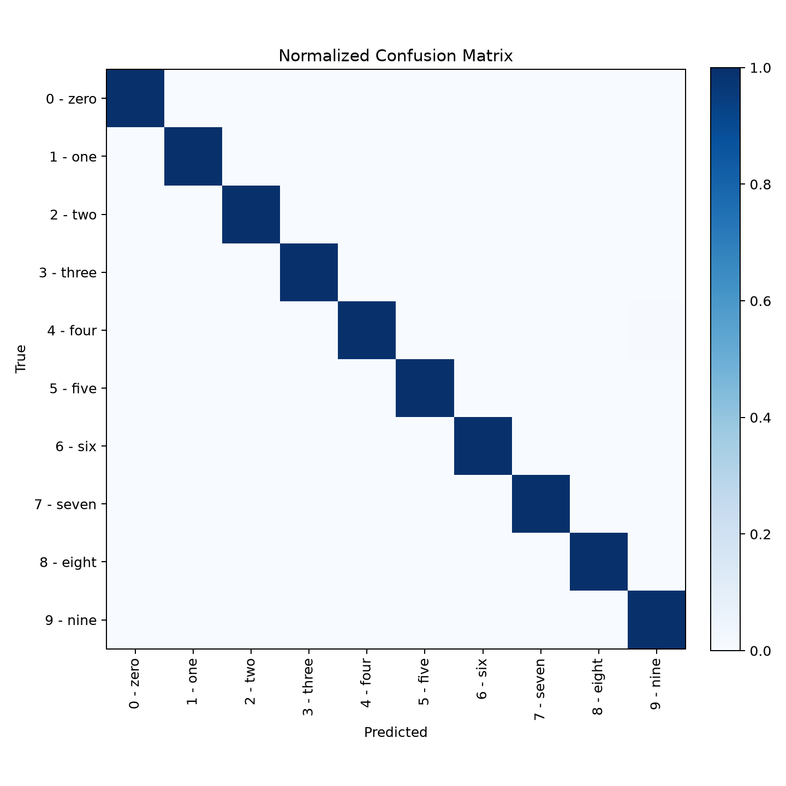</a>
<br><sub><strong>MNIST Digit Specialist — normalized confusion matrix</strong></sub>
</td>
<td width="50%" valign="top">
<a href="./models/reports/emnist_byclass.confusion.png">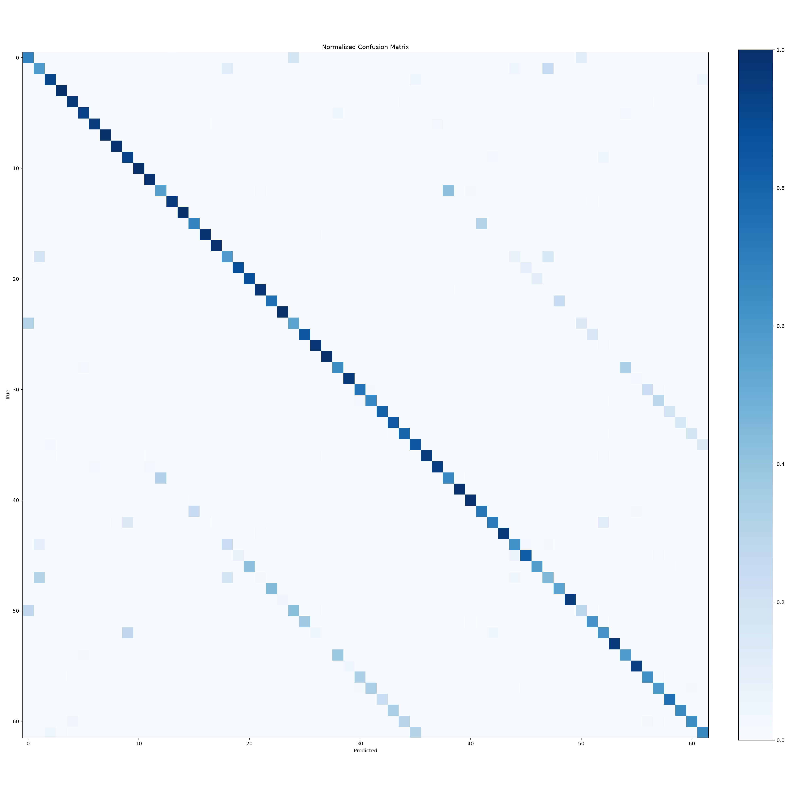</a>
<br><sub><strong>EMNIST ByClass — normalized confusion matrix across 62 classes</strong></sub>
</td>
</tr>
</table>

### Saved Evaluation Artifacts

```text
models/reports/
├── mnist_digit.metrics.json
├── mnist_digit.confusion.png
├── emnist_byclass.metrics.json
└── emnist_byclass.confusion.png
```

The JSON reports preserve the classification report, test loss, best validation Macro F1, epoch history, seed and class count—not just a single headline accuracy number.

---

## Image Preprocessing Pipeline

Real handwriting input rarely arrives in exactly the same shape as MNIST or EMNIST. WriteLens therefore performs deterministic preprocessing before inference.


```mermaid
flowchart LR
    A[PNG / JPEG / WebP or Canvas] --> B[EXIF orientation correction]
    B --> C[RGBA composited on white]
    C --> D[Grayscale]
    D --> E[Gaussian blur]
    E --> F[Polarity correction]
    F --> G[Otsu foreground threshold]
    G --> H[Foreground bounding box]
    H --> I[Square padding]
    I --> J[Scale symbol toward 20 px]
    J --> K[Place on 28 × 28 canvas]
    K --> L[Center using image moments]
    L --> M[Normalize to mean 0.5 / std 0.5]
    M --> N[TorchScript model]
```

Additional safeguards include:

- Large source images are downscaled before processing.
- Empty images are rejected.
- Extremely small detected marks are rejected.
- Transparent backgrounds are composited safely.
- Foreground ratio is measured and returned as recognition metadata.
- A base64 PNG of the normalized input is returned only for the current result display.

---

## Architecture

### System Architecture

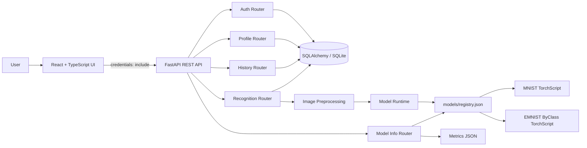
```mermaid
flowchart LR
    U[User] --> UI[React + TypeScript UI]
    UI -->|credentials: include| API[FastAPI REST API]

    API --> AUTH[Auth Router]
    API --> PROFILE[Profile Router]
    API --> REC[Recognition Router]
    API --> HIST[History Router]
    API --> MODEL[Model Info Router]

    AUTH --> DB[(SQLAlchemy / SQLite)]
    PROFILE --> DB
    HIST --> DB
    REC --> DB

    REC --> PRE[Image Preprocessing]
    PRE --> RT[Model Runtime]
    RT --> REG[models/registry.json]
    REG --> DIGIT[MNIST TorchScript]
    REG --> CHAR[EMNIST ByClass TorchScript]

    MODEL --> REG
    MODEL --> REPORTS[Metrics JSON]
```

### Recognition Request Lifecycle

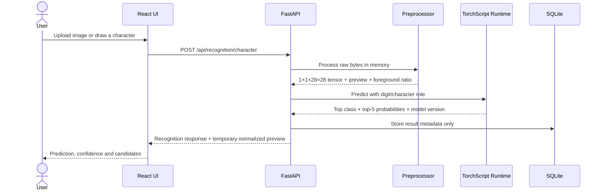
```mermaid
sequenceDiagram
    actor User
    participant UI as React UI
    participant API as FastAPI
    participant Pre as Preprocessor
    participant ML as TorchScript Runtime
    participant DB as SQLite

    User->>UI: Upload image or draw a character
    UI->>API: POST /api/recognition/character
    API->>Pre: Process raw bytes in memory
    Pre-->>API: 1×1×28×28 tensor + preview + foreground ratio
    API->>ML: Predict with digit/character role
    ML-->>API: Top class + top-5 probabilities + model version
    API->>DB: Store result metadata only
    API-->>UI: Recognition response + temporary normalized preview
    UI-->>User: Prediction, confidence and candidates
```

### Training-to-Deployment Lifecycle

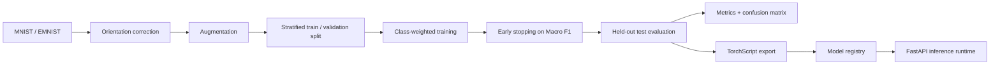
```mermaid
flowchart LR
    D[MNIST / EMNIST] --> O[Orientation correction]
    O --> A[Augmentation]
    A --> S[Stratified train / validation split]
    S --> W[Class-weighted training]
    W --> F[Early stopping on Macro F1]
    F --> T[Held-out test evaluation]
    T --> M[Metrics + confusion matrix]
    T --> J[TorchScript export]
    J --> R[Model registry]
    R --> I[FastAPI inference runtime]
```

---

## Privacy and Security Architecture

Privacy is treated as an application boundary rather than a UI slogan.

### What the Backend Stores

- User email.
- Display name.
- Bcrypt password hash.
- Theme preference.
- Profile-image bytes and MIME type, when provided.
- Hashed session tokens and expiry timestamps.
- Recognition-result metadata.

### What Recognition History Does **Not** Store

- Original uploaded handwriting image.
- Drawing-canvas image.
- Processed `28 × 28` preview.
- Plaintext password.

### Session Security

- Passwords are hashed with **bcrypt** using 12 rounds.
- Session tokens are generated with `secrets.token_urlsafe(48)`.
- Only a SHA-256 hash of each token is stored server-side.
- Browser authentication uses an **HttpOnly** cookie.
- Cookie policy uses `SameSite=Lax`.
- The `Secure` cookie flag is environment-configurable for HTTPS deployment.
- Password changes invalidate other active sessions while preserving the current session.

### No Browser Persistence Contract

The frontend source intentionally avoids:

- `localStorage`
- `sessionStorage`
- IndexedDB

Theme and profile identity are loaded from the authenticated backend account. A dedicated test checks that persistence APIs are not introduced into `frontend/src`.

### API Response Hardening

For `/api/*` responses the middleware adds:

```text
Cache-Control: no-store, no-cache, must-revalidate, private
Pragma: no-cache
X-Content-Type-Options: nosniff
Referrer-Policy: no-referrer
```

---

## Technology Stack

### Frontend

| Technology | Role |
|---|---|
| **React** | Component-based application UI |
| **TypeScript** | Typed state, API contracts and component logic |
| **Vite** | Development server and production build tooling |
| **Lucide React** | Consistent interface iconography |
| **HTML Canvas** | Direct handwriting capture |
| **Fetch API** | Credentialed REST communication |
| **CSS** | Full responsive design system, light/dark themes and interaction states |

### Backend

| Technology | Role |
|---|---|
| **FastAPI** | REST API and OpenAPI documentation |
| **Uvicorn** | ASGI development server |
| **SQLAlchemy 2** | Database ORM and persistence |
| **Pydantic / pydantic-settings** | Request validation and environment configuration |
| **bcrypt** | Password hashing |
| **Pillow** | Image validation and conversion |
| **OpenCV** | Thresholding, geometry and centering operations |
| **NumPy** | Image arrays and numerical preprocessing |
| **python-multipart** | Image/form uploads |

### Machine Learning

| Technology | Role |
|---|---|
| **PyTorch** | CNN and CRNN model implementation/training |
| **TorchVision** | MNIST/EMNIST datasets and augmentation |
| **TorchScript** | Portable runtime checkpoints |
| **scikit-learn** | Stratified splitting and evaluation metrics |
| **Matplotlib** | Confusion-matrix report generation |
| **tqdm** | Training progress |
| **Pandas** | Training/analysis support dependency |

---

## Project Structure

```text
CodeAlpha_Handwritten Character Recognition/
│
├── backend/
│   ├── app/
│   │   ├── main.py                    # FastAPI application
│   │   ├── config.py                  # Environment-backed settings
│   │   ├── db.py                      # SQLAlchemy engine/session
│   │   ├── models.py                  # Users, sessions, recognition records
│   │   ├── schemas.py                 # Pydantic request/response models
│   │   ├── security.py                # Password/session security helpers
│   │   ├── deps.py                    # DB + authenticated-user dependencies
│   │   ├── middleware.py              # No-store/security response headers
│   │   ├── routers/
│   │   │   ├── auth.py                # Register, login, logout, current user
│   │   │   ├── profile.py             # Theme, name, password, avatar
│   │   │   ├── recognition.py         # Character inference endpoint
│   │   │   ├── history.py             # Result archive APIs
│   │   │   └── model_info.py          # Runtime readiness + metrics
│   │   └── services/
│   │       ├── image_preprocessing.py # 28×28 preprocessing pipeline
│   │       └── model_runtime.py        # Registry + TorchScript inference
│   ├── tests/
│   │   ├── test_preprocessing.py
│   │   └── test_privacy_contract.py
│   ├── alembic.ini
│   └── requirements.txt
│
├── frontend/
│   ├── public/brand/                   # Light/dark WriteLens brand assets
│   ├── src/
│   │   ├── components/                 # Brand, avatar, canvas, dropzone, results
│   │   ├── pages/                      # Auth, Recognition, History, Model Lab, Guide, Account
│   │   ├── api.ts                      # REST client
│   │   ├── types.ts                    # Shared frontend data contracts
│   │   ├── App.tsx                     # Main application shell/navigation
│   │   └── styles.css                  # Complete visual system
│   ├── package.json
│   └── vite.config.ts
│
├── ml/
│   ├── datasets.py                     # MNIST / EMNIST loading + transforms
│   ├── models/
│   │   ├── cnn.py                      # Deployed WriteLensCNN
│   │   └── crnn.py                     # Word/line extension model
│   ├── training/
│   │   ├── engine.py                   # Train/evaluate loops + early stopping
│   │   └── metrics.py                  # Accuracy/F1/UAR/confusion matrix
│   └── scripts/
│       ├── download_datasets.py
│       ├── train_classifier.py
│       ├── train_all.py
│       ├── register_models.py
│       ├── evaluate_checkpoint.py
│       └── train_crnn.py
│
├── models/
│   ├── checkpoints/                    # TorchScript + metadata
│   ├── reports/                        # Metrics JSON + confusion matrices
│   └── registry.json                   # Runtime model roles
│
├── data/
│   ├── raw/                            # Downloaded datasets (gitignored)
│   └── processed/                      # Optional processed manifests (gitignored)
│
├── docs/                               # Architecture/privacy/training docs
├── scripts/                            # Windows setup/dev/training/preflight helpers
├── .env.example
├── .gitignore
├── COMMANDS.md
├── FILES.md
├── VALIDATION.md
└── README.md
```

---

## REST API Reference

All protected endpoints use the authenticated HttpOnly session cookie.

### Health

#### `GET /api/health`

```json
{
  "status": "ok",
  "app": "WriteLens"
}
```

### Authentication

| Method | Endpoint | Purpose |
|---|---|---|
| `POST` | `/api/auth/register` | Create a user and authenticated session |
| `POST` | `/api/auth/login` | Validate credentials and create a session |
| `POST` | `/api/auth/logout` | Delete current server session and cookie |
| `GET` | `/api/auth/me` | Return the authenticated user |

Register payload:

```json
{
  "full_name": "Your Name",
  "email": "you@example.com",
  "password": "minimum-8-characters"
}
```

### Profile

| Method | Endpoint | Purpose |
|---|---|---|
| `PATCH` | `/api/profile/theme` | Save `system`, `light` or `dark` theme |
| `PATCH` | `/api/profile/name` | Update display name |
| `PATCH` | `/api/profile/password` | Change password after current-password verification |
| `POST` | `/api/profile/avatar` | Upload PNG/JPEG/WebP profile image up to 2 MB |
| `DELETE` | `/api/profile/avatar` | Remove profile image |
| `GET` | `/api/profile/avatar` | Return current profile image with `no-store` |

### Recognition

#### `POST /api/recognition/character`

Multipart form fields:

| Field | Meaning |
|---|---|
| `image` | Uploaded/drawn image blob |
| `mode` | `auto`, `characters`, or `digits` |
| `source_type` | e.g. `upload` or `draw` |
| `source_name` | Source filename used as metadata |

Example response shape:

```json
{
  "id": 42,
  "primary_label": "S",
  "confidence": 0.381,
  "distribution": [
    {"label": "S", "probability": 0.381},
    {"label": "s", "probability": 0.283}
  ],
  "model_role": "character",
  "model_version": "emnist_byclass-v1",
  "source_type": "draw",
  "source_name": "canvas-character.png",
  "foreground_ratio": 0.091,
  "processed_preview": "data:image/png;base64,...",
  "created_at": "..."
}
```

### History

| Method | Endpoint | Purpose |
|---|---|---|
| `GET` | `/api/recognition/history?limit=50&offset=0` | Paginated recognition metadata |
| `DELETE` | `/api/recognition/history/{record_id}` | Delete one result |
| `DELETE` | `/api/recognition/history` | Clear current user's archive |

History intentionally returns `processed_preview: null`.

### Model Information

| Method | Endpoint | Purpose |
|---|---|---|
| `GET` | `/api/model/status` | Registered checkpoint readiness |
| `GET` | `/api/model/metrics` | Saved evaluation metrics for registered models |

Interactive API documentation is available at:

```text
http://127.0.0.1:8000/docs
```

---

## Database Model

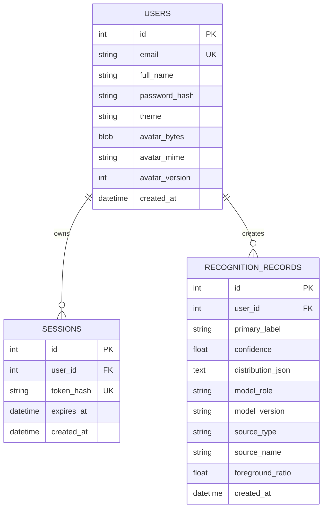
```mermaid
erDiagram
    USERS ||--o{ SESSIONS : owns
    USERS ||--o{ RECOGNITION_RECORDS : creates

    USERS {
      int id PK
      string email UK
      string full_name
      string password_hash
      string theme
      blob avatar_bytes
      string avatar_mime
      int avatar_version
      datetime created_at
    }

    SESSIONS {
      int id PK
      int user_id FK
      string token_hash UK
      datetime expires_at
      datetime created_at
    }

    RECOGNITION_RECORDS {
      int id PK
      int user_id FK
      string primary_label
      float confidence
      text distribution_json
      string model_role
      string model_version
      string source_type
      string source_name
      float foreground_ratio
      datetime created_at
    }
```

---

## Getting Started

### Prerequisites

Install the following before starting:

- **Python** with a PyTorch-compatible version available for your operating system.
- **Node.js + npm** for the React/Vite frontend.
- **Git** if cloning from GitHub.
- Optional: an NVIDIA CUDA environment for faster model training. CPU inference is fully supported.

### 1. Clone the Repository

```powershell
git clone https://github.com/<your-username>/<your-repository>.git
cd "<your-repository>"
```

### 2. Create Local Environment Configuration

```powershell
Copy-Item .env.example .env
```

Generate a strong application secret:

```powershell
python -c "import secrets; print(secrets.token_urlsafe(48))"
```

Copy the generated value into `.env`:

```env
APP_SECRET=paste-the-generated-secret-here
```

### 3. Create the Backend Virtual Environment

```powershell
python -m venv backend\.venv
```

Allow activation for the current PowerShell process:

```powershell
Set-ExecutionPolicy -Scope Process -ExecutionPolicy Bypass
```

Activate:

```powershell
& ".\backend\.venv\Scripts\Activate.ps1"
```

Upgrade packaging tools:

```powershell
python -m pip install --upgrade pip setuptools wheel
```

Install backend requirements:

```powershell
python -m pip install -r backend\requirements.txt
```

Install training/evaluation requirements:

```powershell
python -m pip install -r ml\requirements-train.txt
```

### 4. Initialize the Database Schema

The following command is self-contained and works with the current source package:

```powershell
python -c "import sys; sys.path.insert(0, 'backend'); from app.db import Base, engine; import app.models; Base.metadata.create_all(bind=engine); print('WriteLens database ready.')"
```

This creates the local SQLite database defined by `DATABASE_URL` when it does not already exist.

### 5. Install Frontend Dependencies

```powershell
Push-Location frontend
npm install
Pop-Location
```

---

## Run the Application

### Recommended: Start Backend and Frontend Together

Once the virtual environment and frontend dependencies are ready:

```powershell
powershell -ExecutionPolicy Bypass -File scripts\dev.ps1
```

Open:

```text
WriteLens UI:  http://localhost:5173
FastAPI docs:  http://127.0.0.1:8000/docs
Health check:  http://127.0.0.1:8000/api/health
```

### Or Start Each Service Manually

**Terminal 1 — Backend**

```powershell
& ".\backend\.venv\Scripts\Activate.ps1"
python -m uvicorn app.main:app --app-dir backend --reload --host 127.0.0.1 --port 8000
```

**Terminal 2 — Frontend**

```powershell
cd frontend
npm run dev
```

Vite proxies `/api` requests to `http://127.0.0.1:8000`, so the frontend can use relative API paths with credentialed cookies.

---

## Dataset and Training Commands

> Run all ML commands from the **project root**. Use `python -m ml.scripts...` as shown below so Python resolves the `ml` package correctly.

### Download / Verify Datasets

```powershell
python -m ml.scripts.download_datasets --datasets mnist emnist-balanced emnist-byclass
```

Downloaded data is written below:

```text
data/raw/torchvision/
```

The raw dataset directory is gitignored.

### Train the MNIST Digit Specialist

```powershell
python -m ml.scripts.train_classifier --dataset mnist --epochs 15 --batch-size 256 --lr 0.001 --output-name mnist_digit
```

### Train the EMNIST Balanced Benchmark

```powershell
python -m ml.scripts.train_classifier --dataset emnist-balanced --epochs 25 --batch-size 256 --lr 0.001 --output-name emnist_balanced
```

### Train the EMNIST ByClass Application Model

```powershell
python -m ml.scripts.train_classifier --dataset emnist-byclass --epochs 30 --batch-size 256 --lr 0.001 --output-name emnist_byclass
```

Training automatically saves:

```text
models/checkpoints/<output-name>.pt
models/checkpoints/<output-name>.json
models/reports/<output-name>.metrics.json
models/reports/<output-name>.confusion.png
```

### Optional One-Command Training Helper

The included PowerShell helper can also run the full training sequence. Set the project root on `PYTHONPATH` first so its child script invocations resolve the `ml` package:

```powershell
$env:PYTHONPATH = (Get-Location).Path
powershell -ExecutionPolicy Bypass -File scripts\train_all.ps1
```

For a quick pipeline smoke run, the Python orchestrator supports reduced epochs:

```powershell
$env:PYTHONPATH = (Get-Location).Path
python -m ml.scripts.train_all --batch-size 256 --quick
```

---

## Model Registration and Evaluation

### Register Application Models

After training the checkpoints you want the web application to use:

```powershell
python -m ml.scripts.register_models --digit models\checkpoints\mnist_digit.pt --character models\checkpoints\emnist_byclass.pt
```

This updates:

```text
models/registry.json
```

### Verify Shipped Runtime Artifacts

```powershell
powershell -ExecutionPolicy Bypass -File scripts\verify_models.ps1
```

### Re-Evaluate a Checkpoint

MNIST:

```powershell
python -m ml.scripts.evaluate_checkpoint --checkpoint models\checkpoints\mnist_digit.pt --batch-size 256
```

EMNIST ByClass:

```powershell
python -m ml.scripts.evaluate_checkpoint --checkpoint models\checkpoints\emnist_byclass.pt --batch-size 256
```

---

## CRNN Word Recognition Extension

The main application performs single-character recognition, but the repository also includes a future-facing word/line architecture:

```text
Grayscale image
    ↓
CNN visual encoder
    ↓
Horizontal feature sequence
    ↓
2-layer bidirectional LSTM
    ↓
Per-timestep symbol probabilities
    ↓
CTC loss / decoding path
```

Create a tab-separated manifest:

```text
data/processed/word_manifest.tsv
```

Each row:

```text
path/to/image.png<TAB>transcription
```

Train the CRNN:

```powershell
python -m ml.scripts.train_crnn --manifest data\processed\word_manifest.tsv --epochs 25 --batch-size 32
```

Output:

```text
models/checkpoints/writelens_crnn.pt
models/checkpoints/writelens_crnn.charset.txt
```

This extension is intentionally separate from the currently registered single-character inference roles.

---

## Testing and Validation

### Backend Unit Tests

```powershell
Push-Location backend
python -m pytest tests -v
Pop-Location
```

The included tests cover:

- Preprocessing output shape and normalized-preview generation.
- The frontend privacy contract that rejects use of `localStorage`, `sessionStorage` and IndexedDB persistence APIs.

### Python Compilation Check

```powershell
python -m compileall -q backend\app ml
```

### Frontend Production Build

```powershell
Push-Location frontend
npm run build
Pop-Location
```

### Privacy / Source Preflight

```powershell
powershell -ExecutionPolicy Bypass -File scripts\preflight.ps1
```

### Runtime Model Verification

```powershell
powershell -ExecutionPolicy Bypass -File scripts\verify_models.ps1
```

### Verified Source-Package Checks

During README preparation, the current source package was inspected and the following local checks completed successfully:

```text
✓ Python source compilation
✓ Backend unit tests: 2 passed
✓ Model checkpoint files present
✓ Model metadata present
✓ MNIST evaluation report present
✓ EMNIST ByClass evaluation report present
✓ No browser persistence calls in the tested frontend contract
```

---

## Environment Configuration

Copy `.env.example` to `.env` and keep the real `.env` out of Git.

| Variable | Example / Default | Purpose |
|---|---|---|
| `APP_NAME` | `WriteLens` | Application identity |
| `APP_ENV` | `development` | Environment label |
| `APP_SECRET` | generated secret | Server-side secret value |
| `DATABASE_URL` | `sqlite:///./backend/writelens.db` | SQLAlchemy database URL |
| `SESSION_COOKIE_NAME` | `writelens_session` | Authentication cookie name |
| `SESSION_TTL_HOURS` | `168` | Session lifetime in hours |
| `COOKIE_SECURE` | `false` locally | Set `true` behind HTTPS in production |
| `MAX_IMAGE_BYTES` | `10485760` | Maximum recognition image size (10 MB) |
| `MODEL_REGISTRY_PATH` | `./models/registry.json` | Runtime model registry |
| `FRONTEND_ORIGIN` | defaults to `http://localhost:5173` | Allowed frontend origin for credentialed CORS |

Example:

```env
APP_NAME=WriteLens
APP_ENV=development
APP_SECRET=replace-with-a-long-random-secret
DATABASE_URL=sqlite:///./backend/writelens.db
SESSION_COOKIE_NAME=writelens_session
SESSION_TTL_HOURS=168
COOKIE_SECURE=false
MAX_IMAGE_BYTES=10485760
MODEL_REGISTRY_PATH=./models/registry.json
FRONTEND_ORIGIN=http://localhost:5173
```

> Never commit `.env`, local databases, downloaded datasets, virtual environments or `node_modules`.

---

## Production Hardening

The current architecture is strong for an internship submission, portfolio project and controlled single-service deployment. Before a public multi-user production launch, consider:

- Run only behind HTTPS and set `COOKIE_SECURE=true`.
- Replace the development secret with a managed secret.
- Restrict `FRONTEND_ORIGIN` to the deployed frontend origin.
- Use PostgreSQL or another production database where appropriate.
- Add database migrations to the deployment pipeline.
- Add CSRF protection appropriate to the final cookie/deployment model.
- Add request rate limiting and abuse controls.
- Add structured logging and monitoring without logging handwriting image bytes or credentials.
- Set upload/request body limits at the reverse proxy as well as the application layer.
- Add account lockout or throttling for repeated login failures.
- Add automated frontend tests and end-to-end browser coverage.
- Add CI checks for backend tests, frontend build, source preflight and model-registry validation.
- Store large future model artifacts through an intentional model-artifact strategy if repository size grows.

---

## Responsible Use

Handwriting recognition is probabilistic. Similar glyphs—especially across digits, uppercase letters and lowercase letters—may be visually ambiguous even to humans.

WriteLens therefore exposes candidate probabilities and confidence instead of presenting a prediction as guaranteed truth. For consequential use cases, model output should support rather than replace human review.

The current system is intended for **single handwritten character recognition**. The CRNN path is an extension scaffold for word/line datasets and should not be presented as a production word recognizer until it is trained and evaluated on an appropriate corpus.

---

## Author

<div align="center">

### Muhammad Saad Jadoon

**AI / Machine Learning Developer · Full-Stack Developer**

WriteLens was developed as a machine-learning internship project and expanded into a complete application through custom CNN training, evaluation, image preprocessing, TorchScript deployment, FastAPI backend engineering, database-backed authentication, privacy-aware persistence, React/TypeScript frontend development, and product-level UI/UX refinement.

</div>

---

## Acknowledgements

- **MNIST** — handwritten digit benchmark used for the dedicated digit specialist.
- **EMNIST** — extended handwritten character datasets used for balanced experimentation and 62-class ByClass recognition.
- **PyTorch & TorchVision** — model training, datasets, augmentation and TorchScript export.
- **scikit-learn** — stratified validation splitting and evaluation metrics.
- **FastAPI & SQLAlchemy** — backend API and account/history persistence.
- **React, TypeScript & Vite** — modern browser application architecture.
- **OpenCV & Pillow** — practical handwriting preprocessing and image validation.

---

<div align="center">

### From handwriting pixels to a complete machine-learning product.

**WriteLens — See What You Write**

`Computer Vision` · `Deep Learning` · `Full Stack` · `Privacy-Aware Design` · `Model Transparency`

</div>

<p align="center"><a href="#top"><strong>Back to top ↑</strong></a></p>
